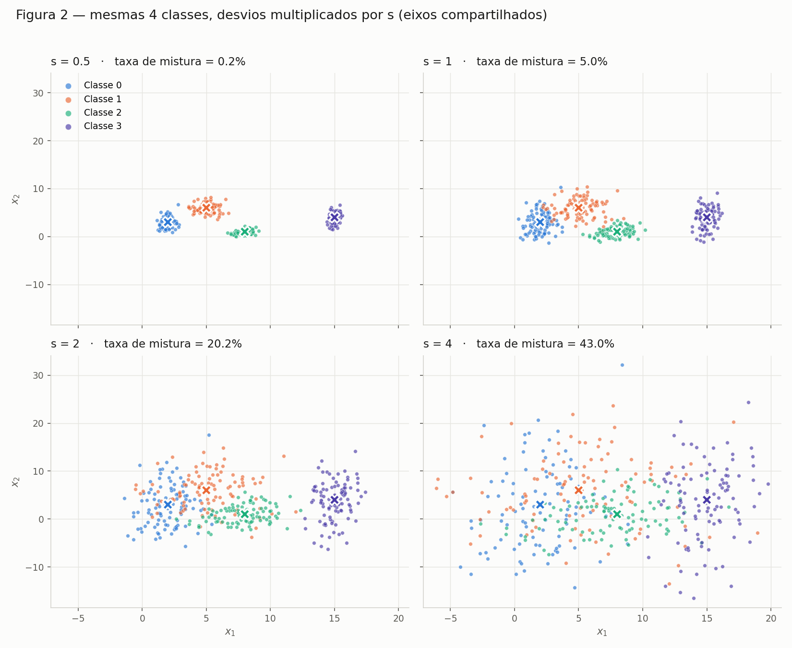
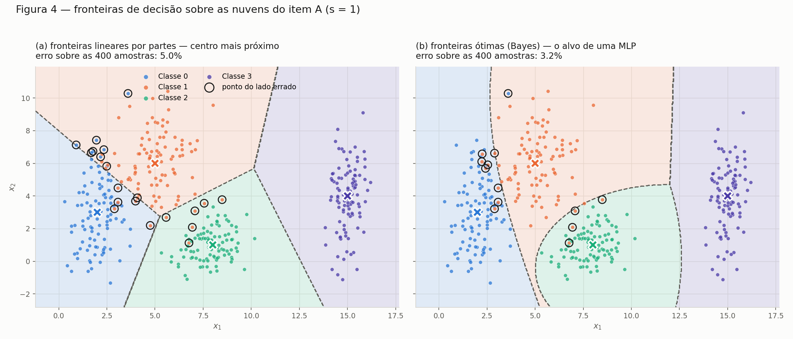

# Nuvens de Pontos: Geometria e Espalhamento em 2D

Exercício sobre distribuição de dados em 2D e o impacto do espalhamento na
complexidade da fronteira de decisão que uma rede neural precisaria aprender.

## Como reproduzir

```bash
python3 ex1_nuvens.py        # Parte A: dados + Figura 1
python3 ex1b_espalhamento.py # Parte B: Figuras 2 e 3 + tabelas
python3 ex1c_analise.py      # Parte C: Figuras 4 e 5 + análise
```

Requisitos: `numpy`, `pandas`, `matplotlib`. Seed fixa (`SEED = 42`) — os números
abaixo são reprodutíveis.

| Arquivo | Conteúdo |
|---|---|
| `ex1_nuvens.py` | Parâmetros, geração das nuvens, Figura 1 |
| `ex1b_espalhamento.py` | Datasets escalados, razões de separação, taxa de mistura, Figuras 2 e 3 |
| `ex1c_analise.py` | Fronteiras de decisão, erro de Bayes, Figuras 4 e 5 |
| `dados_nuvens.csv` | 400 amostras do item A (`x1, x2, classe`) |
| `dados_s{0.5,1,2,4}.csv` | Os 4 datasets do item B |
| `fig1_nuvens.png` … `fig5_erro_irredutivel.png` | Figuras 1 a 5 |

---

## A — Gere as nuvens

400 amostras, 4 classes de 100, gaussianas 2D com covariância diagonal
(cada eixo sorteado com seu próprio desvio, sem correlação entre `x1` e `x2`):

```python
pontos = rng.normal(loc=mu, scale=sigma, size=(100, 2))
```

| Classe | Média μ | Desvio σ |
|---|---|---|
| 0 | (2, 3) | (0.8, 2.5) |
| 1 | (5, 6) | (1.2, 1.9) |
| 2 | (8, 1) | (0.9, 0.9) |
| 3 | (15, 4) | (0.5, 2.0) |

### Figura 1


---

## B — Mais ou menos espalhado

As **mesmas 4 classes**, geradas 4 vezes com todos os desvios multiplicados por
`s ∈ {0.5, 1.0, 2.0, 4.0}`. As médias nunca mudam.

Detalhe de implementação: o mesmo ruído normal padrão `z` é sorteado com a seed
fixa e reescalado — `μ + z·(σ·s)`. Assim as 4 nuvens são literalmente a mesma
nuvem inflada, e a diferença entre os subplots é só o `s`, sem ruído de sorteio.

### B.1 — Figura 2 (eixos compartilhados)



### B.2 — Razão de separação (s = 1)

r<sub>ij</sub> = ‖μ<sub>i</sub> − μ<sub>j</sub>‖ / (σ̄<sub>i</sub> + σ̄<sub>j</sub>),
com σ̄<sub>k</sub> = (σ<sub>k,x</sub> + σ<sub>k,y</sub>) / 2

| Par (i, j) | ‖μᵢ − μⱼ‖ | σ̄ᵢ + σ̄ⱼ | rᵢⱼ |
|---|---|---|---|
| **(0, 1)** | 4.243 | 3.20 | **1.326** ← menor |
| (1, 2) | 5.831 | 2.45 | 2.380 |
| (0, 2) | 6.325 | 2.55 | 2.480 |
| (2, 3) | 7.616 | 2.15 | 3.542 |
| (1, 3) | 10.198 | 2.80 | 3.642 |
| (0, 3) | 13.038 | 2.90 | 4.496 |

**Menor razão: par (0, 1), r = 1.326.** São os dois centros mais próximos
(distância 4.24) e, ao mesmo tempo, as duas nuvens mais gordas (σ̄ = 1.65 e 1.55).

**Valor em s = 2, sem gerar nada:** como as médias não mudam, o numerador é
constante e o denominador escala com `s`, logo r<sub>ij</sub>(s) = r<sub>ij</sub>(1)/s.

> **r₀₁(2) = 1.326 / 2 = 0.663**

### B.3 — Taxa de mistura

Fração de pontos cujo centro de classe mais próximo não é o da própria classe —
medida puramente geométrica, sem treinar nada (distância de cada ponto às 4
médias por broadcasting: `(N,1,2) - (1,4,2)`).

| s | taxa de mistura | menor rᵢⱼ | por classe |
|---|---|---|---|
| 0.5 | 0.25% | 2.652 | C0 1%, resto 0% |
| 1.0 | 5.00% | 1.326 | C0 8%, C1 12%, C2/C3 0% |
| 2.0 | 20.25% | 0.663 | C0 31%, C1 38%, C2 7%, C3 5% |
| 4.0 | 43.00% | 0.331 | C0 51%, C1 56%, C2 43%, C3 22% |

### Figura 3


---

## Respostas (item B)

### A partir de qual fator de escala as nuvens deixam de poder ser separadas por retas?

**A partir de s = 2.**

Em `s = 0.5` e `s = 1` ainda dá: em `s = 1` os 5% de mistura são pontos de borda
entre as classes 0 e 1, e as outras três fronteiras continuam limpas — um conjunto
de retas erra pouco. Em `s = 2` as nuvens 0 e 1 se interpenetram (31% e 38% de
mistura) e a classe 2 já invade as duas; não existe reta que separe 0 de 1, porque
não há mais uma região de baixa densidade entre elas. Em `s = 4` é caos: 43% de
mistura, com o acaso puro em 75% (4 classes equiprováveis).

### O que acontece com o menor rᵢⱼ nesse ponto?

**Ele cruza 1.** r₀₁ vai de 1.326 (`s = 1`) para **0.663** (`s = 2`): a distância
entre os centros passa a ser *menor* que a soma dos espalhamentos das duas nuvens,
ou seja, cada nuvem alcança fisicamente o centro da outra.

**r ≈ 1 é o limiar geométrico** entre "separável por reta" e "sobreposto" — é
exatamente onde a taxa de mistura sai do regime de bordas (5%) e vira estrutural
(20%).

### Consequência para o projeto da arquitetura

- Com `s ≤ 1`, um classificador **linear** (perceptron / softmax de uma camada)
  resolve quase tudo — a fronteira necessária é um conjunto de retas.
- Com `s ≥ 2`, **nenhuma arquitetura resolve**: o erro passa a ser *irredutível*,
  porque as distribuições se sobrepõem na própria entrada. Nem uma rede profunda
  separa o que não é separável nos dados. Aumentar capacidade aqui só produz
  overfitting.

---

## C — Análise

```bash
python3 ex1c_analise.py   # Figuras 4 e 5 + erros das duas fronteiras
```

### C.1 — Sobreposição das quatro classes no dataset original (s = 1)

Olhando a Figura 1, a sobreposição não é uniforme — ela é concentrada em um
único lugar:

- **Classes 0 e 1 — sobreposição real.** Os centros distam 4.24 com σ̄ somando
  3.20 (r₀₁ = 1.33, o menor dos seis pares). A nuvem 0 é alongada em `x₂`
  (σ = 2.5) e a nuvem 1 desce até `x₂ ≈ 2`, então as duas ocupam de fato a mesma
  faixa `x₁ ≈ 3–4`, `x₂ ≈ 4–7`. É aqui que estão praticamente todos os pontos
  ambíguos.
- **Classes 1 e 2 — contato de borda.** r₁₂ = 2.38: os corpos das nuvens estão
  separados, mas a cauda inferior da 1 (`x₂ ≈ 2–3`) encosta na cauda superior
  da 2. Poucos pontos, na fronteira.
- **Classes 0 e 2 — praticamente disjuntas.** r₀₂ = 2.48, separadas na diagonal.
- **Classe 3 — isolada.** Todos os pares com a 3 têm r ≥ 3.5; há um vazio de
  ~4 unidades em `x₁` entre a nuvem 2 e a nuvem 3.

**Uma única fronteira linear separaria todas as classes? Não** — e por dois
motivos independentes. Primeiro, uma reta divide o plano em **2** regiões, e são
**4 classes**: é geometricamente impossível, independentemente dos dados.
Segundo, mesmo o problema binário mais fácil aqui não seria resolvido por uma
única reta com erro zero, porque 0 e 1 se interpenetram.

**E um conjunto de fronteiras lineares? Quase.** Com 3 retas bem posicionadas
(uma vertical em `x₁ ≈ 12` isolando a classe 3; uma separando a 2 das outras;
uma na diagonal entre 0 e 1) chega-se a ~95% de acerto — é exatamente o que faz a
partição por centro mais próximo do painel (a) da Figura 4: **5.0% de erro**. O
que sobra é a região 0∩1, que **nenhum arranjo de retas** resolve, porque ali as
duas classes ocupam o mesmo espaço. Ou seja: fronteiras lineares por partes
(= uma camada softmax) bastam para a *estrutura* do problema; o resíduo não é
falta de capacidade, é sobreposição das distribuições.

### C.2 — Figura 4: fronteiras que uma rede treinada aprenderia



- **(a) Linear por partes** — partição de Voronoi das 4 médias. É o tipo de
  fronteira que um perceptron multiclasse / softmax de uma camada traça: retas.
  Erro: **5.0%**.
- **(b) Ótima de Bayes** — argmax da densidade gaussiana verdadeira. Como as
  classes têm covariâncias *diferentes*, as fronteiras ótimas são **curvas**
  (cônicas), não retas: repare como a fronteira 1↔2 encurva para envolver a
  nuvem 2, que é compacta, e como a região da classe 0 se estreita em `x₂` alto.
  Erro: **3.2%**. É esse o formato que uma MLP com uma camada oculta converge a
  aproximar — o ganho de 5.0% → 3.2% é o que a não-linearidade compra.

Os círculos pretos marcam os pontos que caem do lado errado da fronteira. Note
que **quase todos estão na faixa entre as classes 0 e 1** — os erros não estão
espalhados, estão concentrados na única região de sobreposição real.

### C.3 — Relação com o item B: a região de erro necessário


| s | erro de Bayes (irredutível) | taxa de mistura (item B) | menor rᵢⱼ |
|---|---|---|---|
| 0.5 | 0.02% | 0.25% | 2.652 |
| 1.0 | 3.00% | 5.00% | 1.326 |
| 2.0 | 15.75% | 20.25% | 0.663 |
| 4.0 | 33.38% | 43.00% | 0.331 |

**Quanto mais espalhadas as nuvens, maior a região onde a rede necessariamente
erra** — e ela cresce de duas formas ao mesmo tempo:

1. **Em área.** A faixa ambígua deixa de ser uma fita fina entre duas nuvens e
   vira uma região larga. Em `s = 0.5` ela é praticamente um segmento de medida
   nula (0.02% de erro); em `s = 4` ela cobre boa parte do plano ocupado (33%).
2. **Em número de pares envolvidos.** Em `s = 1` só o par (0, 1) contribui —
   as classes 2 e 3 têm 0% de erro. Em `s = 2` a classe 2 já perde 7% e a 3,
   5%. Em `s = 4` até a classe 3, a mais isolada, erra 22%: a sobreposição
   deixou de ser local e virou global.

O elo com o item B é direto: **rᵢⱼ mede a largura dessa região**. Enquanto
rᵢⱼ > 1 existe um vale de baixa densidade entre as nuvens, e a fronteira pode
ser posta ali com erro pequeno. Quando r₀₁ cruza 1 (entre `s = 1` e `s = 2`) o
vale desaparece: cada nuvem alcança o centro da outra, e **qualquer** fronteira
— reta, curva, ou uma rede de 10 camadas — corta densidade alta dos dois lados.

A curva azul da Figura 5 é o **piso**: nenhuma arquitetura, nenhum treino e
nenhum volume de dados fica abaixo dela, porque ela é uma propriedade da
distribuição, não do modelo. A distância entre a curva laranja e a azul é a
única coisa que a arquitetura controla — e ela é pequena (≈ 2 a 10 pontos
percentuais). **A escolha do modelo compra a diferença entre as duas curvas; o
espalhamento dos dados define onde o piso está.** Treinar mais fundo em `s = 4`
para tentar chegar abaixo de 33% é só decorar ruído.

