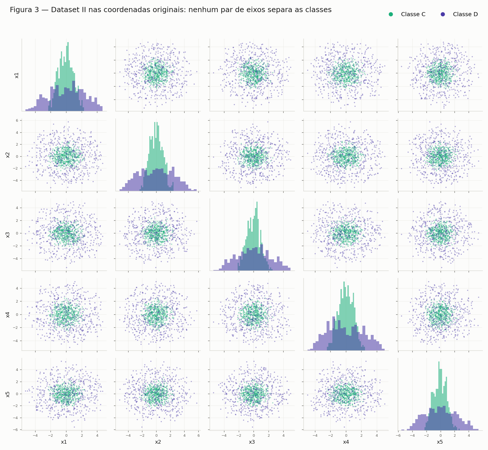
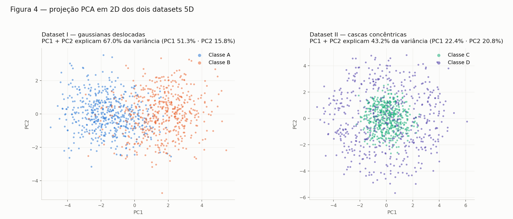
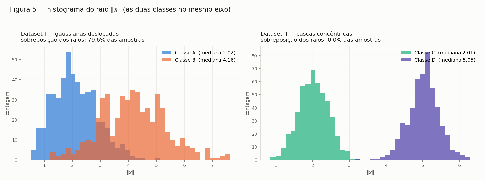

# Exercício 2 — Dados em 5D: gaussianas deslocadas vs. cascas concêntricas

Dois datasets sintéticos de 1000 amostras em 5 dimensões, com estruturas
geométricas opostas, e o que isso implica para o tipo de fronteira de decisão
que uma rede neural precisa aprender.

## Como reproduzir

```bash
python3 ex2_dataset1.py   # A: Dataset I  + Figura 1
python3 ex2_dataset2.py   # B: Dataset II + Figuras 2 e 3
python3 ex2c_pca.py       # C: PCA, Figuras 4 e 5, geometria em 5D
python3 ex2d_analise.py   # D: verificação empírica + Figura 6
```

Requisitos: `numpy`, `pandas`, `matplotlib` (a PCA é feita à mão por SVD, sem
`sklearn`). Seed fixa (`SEED = 42`) — os números abaixo são reprodutíveis.

| Arquivo | Conteúdo |
|---|---|
| `ex2_dataset1.py` | Parâmetros e geração do Dataset I, Figura 1 |
| `ex2_dataset2.py` | Geração do Dataset II (cascas), Figuras 2 e 3 |
| `ex2c_pca.py` | PCA dos dois datasets, Figuras 4 e 5, distâncias em 5D |
| `ex2d_analise.py` | Regressão logística, teto do hiperplano, feature quadrática, Figura 6 |
| `dataset1.csv` | 1000 amostras do Dataset I (`x1…x5, classe`) |
| `dataset2.csv` | 1000 amostras do Dataset II (`x1…x5, classe, raio`) |
| `fig1_dataset1_matriz.png` … `fig6_linear_vs_quadratica.png` | Figuras 1 a 6 |

---

## A — Dataset I: gaussianas deslocadas

500 amostras por classe de uma normal multivariada 5D
(`rng.multivariate_normal(mu, Sigma, size=500)`):

- **Classe A:** μ_A = [0, 0, 0, 0, 0], Σ_A com correlações positivas
  (0.8 entre `x1`–`x2`, 0.5 entre `x3`–`x4`), variâncias 1.0.
- **Classe B:** μ_B = [1.5, 1.5, 1.5, 1.5, 1.5], Σ_B com `x1`–`x2`
  **anti**correlacionados (−0.7) e variâncias 1.5.

### Validação das covariâncias

Uma matriz de covariância precisa ser simétrica e positiva definida — senão a
normal multivariada não existe:

| | simétrica | autovalores | positiva definida |
|---|---|---|---|
| Σ_A | sim | 0.158, 0.468, 0.990, 1.458, 1.927 | ✅ |
| Σ_B | sim | 0.498, 1.025, 1.542, 2.124, 2.312 | ✅ |

O autovalor mínimo de Σ_A (0.158) é pequeno: efeito da correlação 0.8 entre
`x1` e `x2`, que deixa a nuvem A quase achatada nessa direção.

### Conferência amostral

| Classe | média amostral | média teórica | max \|cov amostral − Σ\| |
|---|---|---|---|
| A | (0.026, 0.085, 0.037, 0.019, 0.035) | 0 | 0.086 |
| B | (1.524, 1.452, 1.473, 1.519, 1.530) | 1.5 | 0.137 |

### Figura 1


Diagonal: distribuições marginais. Fora da diagonal: pares de variáveis.

**Duas leituras:**

- **As marginais se sobrepõem muito.** Um deslocamento de 1.5 com σ ≈ 1.0–1.22
  não separa: nenhuma variável isolada distingue as classes. Só a combinação
  das 5 dimensões separa.
- **A correlação `x1`–`x2` troca de sinal entre as classes** (+0.8 em A, −0.7
  em B). No painel `x1`×`x2` a nuvem A é uma elipse esticada na diagonal ↗ e a
  B na diagonal ↘, formando um X. Isso é informação de **forma**, não de
  posição: uma fronteira linear não a aproveita, uma quadrática (ou uma rede)
  sim.

---

## B — Dataset II: cascas concêntricas

Mesmos 500 por classe, mesmas 5 dimensões, estrutura radial:

```python
v = rng.standard_normal((n, 5))                   # v ~ N(0, I5)
u = v / np.linalg.norm(v, axis=1, keepdims=True)  # direção uniforme na esfera
rho = rng.normal(raio, 0.4, size=(n, 1))          # C: raio 2.0 · D: raio 5.0
x = rho * u
```

> **Nota sobre o enunciado:** ele escreve `ρ ~ N(2.0, 0.4)` sem dizer se 0.4 é
> desvio ou variância. Adotei **0.4 como desvio padrão** (é a leitura que casa
> com o Exercício 1). Está isolado na constante `SIGMA_RHO` — se for variância,
> basta trocar por `sqrt(0.4) = 0.632`. As cascas continuam sem se tocar nos
> dois casos.

### Conferência

| Classe | raio médio (alvo) | desvio do raio | desvio por eixo | esperado ρ/√5 |
|---|---|---|---|---|
| C | 2.027 (2.0) | 0.405 | ≈ 0.92 | 0.894 |
| D | 5.026 (5.0) | 0.421 | ≈ 2.26 | 2.236 |

A média por eixo dá ≈ 0 nas duas classes (a direção é isotrópica), e o desvio
por eixo bate com `ρ/√5` — a variância do raio se reparte igualmente entre as
5 coordenadas.

**As cascas não se tocam:** maior raio de C = 3.224, menor raio de D = 3.244.
O corte `‖x‖ = 3.234` separa as duas classes com **0% de erro**.

### Figura 2


- **(a)** na projeção `x1`×`x2` as classes viram dois discos concêntricos
  sobrepostos. Repare que D **não** aparece como um anel: em 5D, projetar uma
  casca sobre 2 coordenadas preenche o disco (a densidade marginal é máxima no
  centro), então D cobre inteiramente C.
- **(b)** a norma `‖x‖`, uma única dimensão derivada, separa perfeitamente.

### Figura 3



Nenhum par de eixos originais separa as classes: em todos os 20 painéis a nuvem
de D envolve a de C.

### Diferença estrutural em relação ao Dataset I

No Dataset I as classes têm médias diferentes, então existe uma direção `w` em
que as projeções se afastam — um classificador linear funciona razoavelmente.
Aqui **as duas classes têm a mesma média (zero)**: qualquer hiperplano
`w·x + b` recebe as duas distribuições centradas no mesmo ponto e acerta ~50%,
o acaso. A não-linearidade deixa de ser um ganho marginal e vira a única saída —
a rede precisa construir algo equivalente a `‖x‖²`, que uma camada oculta
produz somando quadrados de ativações.

---

## C — Visualize e compare

### C.1 — Figura 4: PCA em 2D



PCA por SVD sobre os dados centrados (não padronizados — as escalas já são
comparáveis), com os dois datasets lado a lado e coloridos por classe.

### C.2 — Variância explicada

| | PC1 | PC2 | PC3 | PC4 | PC5 | **PC1+PC2** |
|---|---|---|---|---|---|---|
| Dataset I | 51.3% | 15.8% | 14.4% | 12.5% | 6.0% | **67.0%** |
| Dataset II | 22.4% | 20.8% | 20.6% | 19.0% | 17.1% | **43.2%** |

**Em qual dos datasets a projeção 2D preserva melhor a informação relevante
para a classificação? No Dataset I** — por dois motivos que vale separar:

1. **Quantidade:** 67.0% vs 43.2%. No Dataset I existem direções privilegiadas
   (as correlações fortes de Σ_A e Σ_B, mais o deslocamento das médias), e a
   variância se concentra em PC1. No Dataset II o espectro é **plano**
   (≈ 20% em cada componente): a distribuição é isotrópica, nenhuma direção é
   especial, e 43.2% é praticamente o 2/5 = 40% que se obteria escolhendo dois
   eixos ao acaso.
2. **Qualidade — que é o ponto:** variância explicada **não** é a mesma coisa
   que informação para classificar. No Dataset I a direção de maior variância
   coincide com a direção que separa as classes (μ_B − μ_A aponta para
   [1,1,1,1,1]), então PC1 sozinho já quase resolve. No Dataset II a informação
   discriminante está em `‖x‖² = Σxᵢ²`, uma função **quadrática de todas as 5
   coordenadas** — nenhuma projeção linear 2D a preserva. Ao descartar 3 eixos,
   o raio projetado vira um subestimador ruidoso do raio real e as cascas borram
   uma sobre a outra. A PCA não falha por escolher mal os componentes:
   **não existe projeção linear 2D boa**, porque a estrutura não é linear.

### C.3 — Geometria em 5D

| | ‖μ₁ − μ₂‖ | raio classe 1 | raio classe 2 | sobreposição dos raios |
|---|---|---|---|---|
| Dataset I (A, B) | **3.264** (teórico 1.5·√5 = 3.354) | 2.109 ± 0.788 | 4.175 ± 1.161 | **79.6%** |
| Dataset II (C, D) | **0.159** (teórico 0) | 2.027 ± 0.405 | 5.026 ± 0.421 | **0.0%** |

A "sobreposição" é a fração de amostras que cai na faixa de raios onde as duas
classes coexistem — uma medida simples de quanto `‖x‖` sozinho confunde.

### Figura 5



- **Dataset I:** centros bem separados (3.26), mas os raios se misturam em
  79.6% — a classe A tem pontos longe da origem e a B tem pontos perto. O raio
  ainda carrega sinal parcial (como μ_B está longe da origem, B tende a ter raio
  maior: um corte em `‖x‖` acerta 86.3%), mas fica **abaixo** da fronteira
  linear (88.7%, item D): a feature certa aqui é a **projeção numa direção**
  (produto interno), não a distância à origem.
- **Dataset II:** centros coincidentes (0.159 é só ruído amostral com n = 500),
  então nenhuma direção separa — mas os raios não se tocam (0.0%). O raio é a
  feature perfeita.

---

## D — Análise

```bash
python3 ex2d_analise.py
```

Além do argumento geométrico, cada afirmação abaixo foi verificada rodando um
classificador: regressão logística implementada com numpy (gradiente em batch
completo) sobre as 5 coordenadas cruas.

### D.1 — Centros coincidentes + raios separados: o que isso diz sobre o hiperplano?

Diz que **as classes são perfeitamente separáveis, mas não por um hiperplano** —
a informação que as distingue não é do tipo que um hiperplano consegue ler.

Um hiperplano decide por `w·x + b > 0`: ele só enxerga o dado através da
**projeção escalar `w·x`**, uma única direção. Duas consequências:

1. **Os centros coincidem (‖μ_C − μ_D‖ = 0.159 ≈ 0), então para qualquer `w` as
   duas projeções ficam centradas no mesmo ponto.** Como as duas distribuições
   são esfericamente simétricas em torno da origem, `w·x` é simétrico em torno
   de 0 nas duas classes — elas diferem apenas na **largura** (desvio
   `ρ/√5`: 0.89 para C, 2.24 para D), não na posição. Um limiar não distingue
   "estreito" de "largo".
2. **Os raios se separam (0% de sobreposição), então a informação existe** — ela
   está em `‖x‖`, que depende de **todas** as coordenadas ao mesmo tempo e de
   forma quadrática. É informação de *escala*, não de *posição*, e projeção
   escalar destrói escala.

Medido:

| | regressão logística (5D cru) |
|---|---|
| Dataset I | **88.7%** |
| Dataset II | **53.6%** |

No Dataset II a regressão logística converge para o acaso, e não é falta de
treino: o ótimo de log-loss ali é literalmente `w = 0`, porque qualquer direção
que ela escolha recebe as duas classes centradas no mesmo lugar.

### D.2 — Por que mais dados não resolvem

Porque o limite **não é estatístico, é representacional**. Mais dados reduzem a
incerteza sobre os parâmetros de uma fronteira; não mudam o conjunto de
fronteiras que a família consegue expressar. O conjunto separador verdadeiro é
`{x : ‖x‖ < 3.23}`, uma **hiperesfera** — uma região limitada e fechada. Um
semiespaço `{x : w·x + b > 0}` é ilimitado em todas as direções perpendiculares
a `w`. Nenhum semiespaço é igual a uma bola, e isso é uma afirmação de geometria:
independe de quantas amostras existam.

Varrendo `n`:

| n por classe | regressão logística | melhor hiperplano possível |
|---|---|---|
| 500 | 53.4% | 63.5% |
| 2 000 | 52.1% | 63.2% |
| 10 000 | 51.0% | 62.1% |
| 50 000 | 50.5% | 61.9% |

A segunda coluna é o **teto** de qualquer hiperplano: varremos direções
aleatórias e, para cada uma, o melhor corte possível (busca exaustiva). Ele fica
em ~62% e **não sobe com mais dados** — ao contrário, converge para o valor
assintótico. Esses 62% vêm de um truque degenerado: cortar bem longe do centro,
onde só existem pontos de D (a classe mais espalhada tem caudas mais longas);
acerta quase toda a C e uma fatia pequena da D. É o máximo que a geometria de um
semiespaço permite arrancar de duas esferas concêntricas — e continua a 38
pontos percentuais da solução correta.

> A regressão logística fica **abaixo** desse teto (50–53%) porque otimiza
> log-loss, não acurácia, e o ótimo de log-loss no problema simétrico é `w = 0`.
> As duas colunas contam a mesma história por caminhos diferentes.

### D.3 — Uma projeção 2D ruim prova que as classes são inseparáveis?

**Não. A implicação só vale num sentido:**

- projeção 2D **separa** ⟹ o espaço original separa (a projeção é uma função dos
  dados originais; se ela separa, compor essa projeção com o corte é um
  classificador válido em 5D);
- projeção 2D **não separa** ⟹ **nada** se conclui sobre o espaço original.

E a PCA torna isso ainda mais provável, por dois motivos: ela é **linear** (só
faz combinações `Σ aᵢxᵢ`, nunca produtos ou quadrados) e é **não supervisionada**
(maximiza variância total, sem olhar para os rótulos — ela não sabe que existem
classes).

**Justificativa com os resultados deste exercício** — o Dataset II é um
contraexemplo completo:

| evidência | valor |
|---|---|
| Figura 4 (direita): PC1+PC2 explicam | 43.2%, e as classes aparecem **misturadas** |
| Figura 3: os 20 painéis de pares de eixos | nenhum separa |
| Figura 2b / Figura 5: separação por `‖x‖` | **0% de sobreposição** |
| corte em `‖x‖² ` | **100% de acurácia** |

Ou seja: a projeção mostrou "inseparável" e a verdade é "perfeitamente
separável". A projeção falhou, não os dados.

### A função que separa o Dataset II

$$f(x) = \|x\|^2 - 10.46 = x_1^2 + x_2^2 + x_3^2 + x_4^2 + x_5^2 - 10.46$$

$$f(x) < 0 \Rightarrow \text{Classe C} \qquad f(x) > 0 \Rightarrow \text{Classe D}$$

O limiar 10.46 é `3.234²`, o ponto médio entre o maior raio de C (3.224) e o
menor raio de D (3.244). **Acurácia: 100.0%** sobre as 1000 amostras.


Repare no que a Figura 6 mostra: em (a), a melhor combinação linear coloca as
duas classes empilhadas em torno de zero — só as larguras diferem. Em (b), a
mesma informação em coordenadas quadráticas vira dois montes disjuntos, com um
corte trivial entre eles.

**O detalhe que interessa para redes neurais:** `f` é uma função **linear** das
features transformadas `z = (x₁², x₂², x₃², x₄², x₅²)` — é o mesmo hiperplano
`w·z + b` com `w = [1,1,1,1,1]` e `b = −10.46`. O problema nunca foi "precisa de
uma fronteira exótica"; era só que a fronteira é linear no espaço **errado**. É
exatamente isso que uma camada oculta faz: aprende uma transformação `z = φ(x)`
que torna o problema linearmente separável, e a camada de saída traça o
hiperplano. Com ativações suaves, alguns neurônios somando quadrados aproximados
já reconstroem `‖x‖²`.

---

## Síntese

Os dois datasets são **exatamente opostos** quanto ao tipo de fronteira exigida:

| | ‖μ₁ − μ₂‖ | acurácia linear | acurácia com `‖x‖²` | fronteira necessária |
|---|---|---|---|---|
| Dataset I | 3.264 | **88.7%** | 86.3% | hiperplano — uma camada linear já resolve quase tudo |
| Dataset II | 0.159 | 53.6% (teto de 62%) | **100.0%** | hiperesfera — exige não-linearidade |

Cada um exige uma família de fronteira diferente, e as duas colunas do meio
trocam de vencedor entre as linhas. A lição de projeto: **antes de escolher a
arquitetura, olhe a geometria dos dados** — a profundidade da rede não substitui
a feature certa, e a feature certa às vezes torna a rede quase desnecessária.
