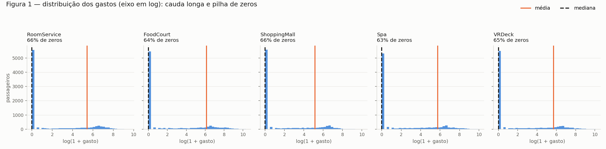
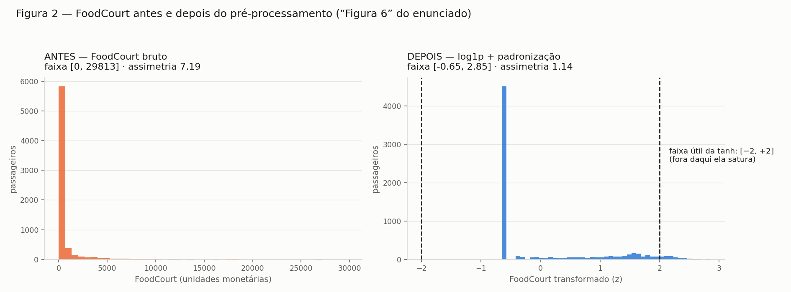

# Exercício 3 — Preparando Dados do Mundo Real para uma Rede Neural

Pré-processamento do dataset **Spaceship Titanic** (Kaggle) para uma rede neural
com ativação **tanh** nas camadas ocultas.

## Como reproduzir

```bash
# baixe train.csv em kaggle.com/competitions/spaceship-titanic/data
python3 ex3a_conhecer.py       # A: exploração dos dados + Figura 1
python3 ex3bcd_preprocessa.py  # B, C, D: split, pré-processamento, checagens
```

Requisitos: `numpy`, `pandas`, `matplotlib`. O `train.csv` **não** está
versionado (é preciso aceitar as regras da competição para baixar).

| Arquivo | Conteúdo |
|---|---|
| `ex3a_conhecer.py` | Balanceamento, tipos, faltantes, estatísticas de gasto, Figura 1 |
| `ex3bcd_preprocessa.py` | Split estratificado, imputação, one-hot, log1p, escalonamento, Figura 2 |
| `dados_processados.npz` | `Xtr, ytr, Xte, yte` prontos para a rede |
| `train.csv` | Dados (baixar do Kaggle) |
| `fig1_gastos.png` | Distribuição das 5 colunas de gasto |
| `fig2_antes_depois.png` | `FoodCourt` antes e depois do pré-processamento |

---

## A — Conheça os dados

`train.csv`: **8 693 linhas × 14 colunas**.

### A.1 — Objetivo do dataset e o que é `Transported`

A nave *Spaceship Titanic* colidiu com uma anomalia espaço-temporal e parte dos
passageiros foi **transportada para outra dimensão**. A tarefa é prever quais.

`Transported` é o **alvo**: booleano, `True` = o passageiro foi transportado,
`False` = permaneceu a bordo. É portanto uma **classificação binária**, e a
coluna não tem nenhum valor faltante (8 693/8 693 preenchidos).

### A.2 — Balanceamento das classes

| classe | passageiros | proporção |
|---|---|---|
| `True` | 4 378 | **50.36%** |
| `False` | 4 315 | **49.64%** |

Razão entre classes: **1.015 : 1** — praticamente perfeito. Consequências
práticas: acurácia é uma métrica honesta aqui (o baseline burro acerta 50.4%, não
90% como em datasets desbalanceados), não é preciso usar `class_weight`,
reamostragem ou métrica alternativa, e a camada de saída pode ser um único
neurônio sigmoide com binary cross-entropy sem ajuste de limiar.

### A.3 — Features: numéricas vs. categóricas

**Numéricas (6):**

| coluna | descrição | faixa |
|---|---|---|
| `Age` | idade do passageiro | 0 a 79 (média 28.8, mediana 27) |
| `RoomService` | gasto no serviço de quarto | 0 a 14 327 |
| `FoodCourt` | gasto na praça de alimentação | 0 a 29 813 |
| `ShoppingMall` | gasto nas lojas | 0 a 23 492 |
| `Spa` | gasto no spa | 0 a 22 408 |
| `VRDeck` | gasto no deck de realidade virtual | 0 a 24 133 |

**Categóricas (5):**

| coluna | cardinalidade | valores |
|---|---|---|
| `HomePlanet` | 3 | Europa, Earth, Mars |
| `Destination` | 3 | TRAPPIST-1e, PSO J318.5-22, 55 Cancri e |
| `CryoSleep` | 2 (booleana) | False, True — 35.8% em criosono |
| `VIP` | 2 (booleana) | False, True — só 2.34% são VIP |
| `Cabin` | **6 560** | ex.: `B/0/P`, `F/1/S` |

**Identificadores (2), fora do modelo:** `PassengerId` e `Name`.

Três observações que já apontam para o pré-processamento:

- **`Cabin` não é uma categórica comum.** Com 6 560 valores distintos em 8 693
  linhas, um one-hot direto criaria mais colunas que linhas. Ela é **composta**,
  no formato `deck/num/side`: deck ∈ {A…G, T} (8 valores), num ∈ [0, 1894],
  side ∈ {P, S}. O caminho é **quebrar em três colunas** — duas categóricas de
  baixa cardinalidade e uma numérica.
- **`PassengerId` tem estrutura**: o formato `gggg_pp` codifica grupo e posição —
  são 6 217 grupos para 8 693 passageiros, ou seja, muita gente viaja
  acompanhada. O id em si não é feature, mas o *tamanho do grupo* é uma feature
  derivável.
- **`CryoSleep` domina os gastos**: dos 3 037 passageiros em criosono,
  **exatamente zero** gastaram qualquer valor — quem está hibernando não
  consome. E o sinal é forte: 81.8% dos criogenizados foram transportados,
  contra 32.9% dos demais.

### A.4 — Valores faltantes

| coluna | faltantes | % do total |
|---|---|---|
| `CryoSleep` | 217 | 2.50% |
| `ShoppingMall` | 208 | 2.39% |
| `VIP` | 203 | 2.34% |
| `HomePlanet` | 201 | 2.31% |
| `Name` | 200 | 2.30% |
| `Cabin` | 199 | 2.29% |
| `VRDeck` | 188 | 2.16% |
| `FoodCourt` | 183 | 2.11% |
| `Spa` | 183 | 2.11% |
| `Destination` | 182 | 2.09% |
| `RoomService` | 181 | 2.08% |
| `Age` | 179 | 2.06% |
| `PassengerId` | 0 | 0.00% |
| `Transported` | 0 | 0.00% |

Duas leituras:

- **Coluna a coluna, o problema é pequeno**: nenhuma passa de 2.5%, e a taxa é
  notavelmente uniforme (2.06% a 2.50%) — parece ausência aleatória, não uma
  coluna quebrada.
- **Linha a linha, o problema é grande**: só **75.99%** das linhas estão
  completas. **24.01% têm pelo menos um NaN** — porque os buracos estão
  espalhados por 12 colunas diferentes e raramente coincidem na mesma linha.

Ou seja, `dropna()` custaria **2 087 passageiros (1 em cada 4)** para resolver
buracos que somam ~2% dos valores. **Imputar é obrigatório**, não uma
preferência de estilo.

### A.5 — Colunas de gasto

Sobre **todos** os 8 693 passageiros:

| coluna | média | **mediana** | máximo | desvio | % zeros | p90 | p99 | assimetria |
|---|---|---|---|---|---|---|---|---|
| `RoomService` | 224.69 | **0.00** | 14 327 | 666.72 | 64.2% | 753 | 3 096 | 6.33 |
| `FoodCourt` | 458.08 | **0.00** | 29 813 | 1 611.49 | 62.8% | 1 026 | 8 033 | 7.10 |
| `ShoppingMall` | 173.73 | **0.00** | 23 492 | 604.70 | 64.3% | 620 | 2 333 | 12.63 |
| `Spa` | 311.14 | **0.00** | 22 408 | 1 136.71 | 61.2% | 732 | 5 390 | 7.64 |
| `VRDeck` | 304.85 | **0.00** | 24 133 | 1 145.72 | 63.2% | 733 | 5 647 | 7.82 |

Como a mediana é 0 em todas, a razão média/mediana não existe. Refazendo **só
entre quem gastou** (valor > 0):

| coluna | n (gastaram) | média | mediana | máximo | média/mediana | % do gasto total |
|---|---|---|---|---|---|---|
| `RoomService` | 2 935 | 651.63 | 320.00 | 14 327 | 2.04 | 15.3% |
| `FoodCourt` | 3 054 | 1 276.44 | 396.50 | 29 813 | **3.22** | 31.1% |
| `ShoppingMall` | 2 898 | 508.66 | 195.00 | 23 492 | 2.61 | 11.8% |
| `Spa` | 3 186 | 831.07 | 226.50 | 22 408 | **3.67** | 21.1% |
| `VRDeck` | 3 010 | 861.39 | 260.00 | 24 133 | **3.31** | 20.7% |

E a concentração:

| grupo | fatia do gasto total |
|---|---|
| 1% maiores gastadores (86 pessoas) | **13.6%** |
| 5% maiores (434 pessoas) | **38.6%** |
| 10% maiores (869 pessoas) | **55.9%** |



*(eixo em `log(1+gasto)`, senão tudo colapsa numa barra em zero; linha laranja =
média, tracejada preta = mediana)*

### O que a diferença entre média e mediana indica

**Que as distribuições são fortemente assimétricas à direita, com cauda longa —
e que a média não descreve nenhum passageiro típico.**

Em uma distribuição simétrica, média ≈ mediana. Aqui a média é **infinitamente
maior** que a mediana em termos relativos (mediana 0), e mesmo entre quem gastou
a média vale 2 a 3.7 vezes a mediana. Três fatos concretos:

1. **Assimetria positiva extrema.** O coeficiente de assimetria vai de **6.33 a
   12.63** (uma normal tem 0; acima de 1 já se considera muito assimétrico). A
   média é puxada para cima por poucos valores enormes: em `FoodCourt`, o
   máximo (29 813) é **65 vezes a média** e está **18 desvios-padrão** acima dela.
2. **São duas populações misturadas.** A Figura 1 é bimodal: uma pilha de zeros
   (~63%, boa parte explicada pelo criosono) e um monte de gastadores. A média
   de 458 no `FoodCourt` cai num vale onde quase ninguém está — ninguém é
   "médio" aqui.
3. **O espalhamento é dominado pela cauda.** O desvio-padrão supera a média em
   todas as colunas (`FoodCourt`: 1 611 vs 458 → coeficiente de variação 3.5), e
   10% dos passageiros respondem por 56% de todo o gasto da nave.

**Por que isso importa para uma rede com tanh:** `tanh` satura fora de
aproximadamente [−2, 2] — `tanh(3) = 0.995`, e a derivada lá já é ~0.01, o que
mata o gradiente. Alimentar a rede com valores de 0 a 29 813 satura todos os
neurônios de saída. E o z-score sozinho **não** resolve: padronizando
`FoodCourt`, o máximo vira `(29813 − 458)/1611 = **18.2**` — 9 vezes além do
ponto de saturação, enquanto os 63% de zeros se amontoam em −0.28. A escala
linear não conserta assimetria; é preciso primeiro **comprimir a cauda** (por
exemplo `log1p`) e só então padronizar. É exatamente o que os próximos itens
vão tratar.

---

## B — Separe antes de transformar

```
treino:  6 954 linhas (80.0%) | Transported=True: 50.36%
teste :  1 739 linhas (20.0%) | Transported=True: 50.37%
dataset completo:                              50.36%
```

Split 80/20 **estratificado** pelo alvo, semente fixa (`SEED = 42`), implementado
em `separar_estratificado()`: embaralha os índices dentro de cada classe e corta
20% de cada uma — o que garante que a proporção de `True` seja idêntica nos dois
lados (50.36% vs 50.37%, diferença de uma única linha).

### Por que a separação vem antes da imputação e do escalonamento

Porque o conjunto de teste existe para **simular dados que o modelo nunca viu**,
e essa simulação só é honesta se nenhuma informação do teste tiver influenciado o
treino. Se a mediana usada na imputação, a média/desvio do escalonamento ou a
lista de categorias do one-hot forem calculadas sobre o dataset inteiro, cada uma
dessas estatísticas carrega um resumo das linhas de teste para dentro do
pré-processador — o modelo passa a treinar com um traço do teste embutido nas
features. O resultado é uma métrica **otimista demais**, que não se repete em
produção, onde os dados novos de fato não participaram do cálculo de nada.

Concretamente, aqui: as medianas, a lista de categorias e a média/desvio do
z-score foram todas ajustadas com `pp.fit(treino)` e depois **apenas aplicadas**
com `pp.transform(teste)`.

---

## C — Pré-processe

### C.1 — Dados faltantes: uma estratégia por tipo

| tipo | estratégia | justificativa |
|---|---|---|
| **numéricas** (`Age` + 5 gastos) | **mediana do treino** | as distribuições de gasto têm assimetria de 6 a 12 (item A) e a média é puxada pela cauda; a mediana é robusta a outliers e não inventa um valor que nenhum passageiro tem. Para `Age` a mediana é 27; para os cinco gastos ela é **0**, que é também a moda (>61% de zeros) e o valor estruturalmente correto para quem está em criosono. |
| **categóricas** (`HomePlanet`, `CryoSleep`, `Destination`, `VIP`) | **nível explícito `Desconhecido`** | preencher com a moda finge uma certeza que não existe e distorce as frequências (`VIP` viraria 100% `False`). Criar um nível próprio preserva a informação "esse dado faltou" — que pode ser preditiva — e o one-hot já lida com isso naturalmente, sem custo. |

Estatísticas aprendidas **só no treino** e reaplicadas no teste.

### C.2 — Features categóricas: one-hot

| coluna | colunas geradas |
|---|---|
| `HomePlanet` | Earth, Europa, Mars, Desconhecido (4) |
| `CryoSleep` | False, True, Desconhecido (3) |
| `Destination` | 55 Cancri e, PSO J318.5-22, TRAPPIST-1e, Desconhecido (4) |
| `VIP` | False, True, Desconhecido (3) |

Mantive **todas** as categorias (sem `drop_first`): uma rede neural não sofre com
a colinearidade que incomoda uma regressão linear, e manter a coluna completa
torna o tratamento de categoria desconhecida inequívoco (ver abaixo).

**Como o código trata uma categoria que aparece no teste mas não no treino.**
A lista de categorias é congelada no `fit`, e o `transform` constrói as colunas
por comparação (`v == categoria`) sobre essa lista fixa. Uma categoria nova
simplesmente não casa com nenhuma delas e produz **uma linha de zeros** naquele
bloco:

```
categoria nunca vista no treino ('Titan'):
 HomePlanet=Earth  HomePlanet=Europa  HomePlanet=Mars  HomePlanet=Desconhecido
              0.0                0.0              0.0                      0.0
```

Isso é o comportamento desejado por três motivos: **não quebra** (nenhuma
exceção), **não cria coluna nova** (o `shape` do teste continua igual ao do
treino — obrigatório, senão a matriz não entra na rede), e é
**semanticamente honesto** — "não é nenhuma das origens conhecidas" é exatamente
o que a rede deve receber. O custo é que `Titan` fica indistinguível de outra
origem desconhecida; se isso importasse, a solução seria mapear categorias raras
para `Desconhecido` já no treino.

### C.3 — Engenharia de features

- **`TotalSpend`** = soma das cinco colunas de gasto, calculada **após** a
  imputação (senão um NaN contaminaria a soma inteira). Ela resume em uma
  variável "esse passageiro consumiu algo a bordo?", que o item A mostrou ser o
  eixo mais informativo — e, sendo o complemento quase perfeito do criosono, dá à
  rede o sinal agregado sem depender de ela somar cinco entradas sozinha.
- **Descartadas:** `PassengerId` e `Name` (identificadores: memorizá-los é
  overfitting puro) e `Cabin` (6 560 valores distintos — one-hot criaria mais
  colunas que linhas). *Observação: `Cabin` não é lixo — dividida em
  `deck/num/side` renderia três features de baixa cardinalidade. O enunciado pede
  para descartar, então foi descartada, mas fica registrado como o próximo ganho
  fácil.*

### C.4 — Cauda pesada: `log(1 + x)`

Aplicado às cinco colunas de gasto e a `TotalSpend` (`Age` não precisa —
assimetria 0.42, já bem-comportada).

Efeito medido em `FoodCourt`: **assimetria 7.19 → 1.14**, faixa
`[0, 29 813] → [0, 10.3]`. Ver a Figura 2 na seção D.

**Por que isso ajuda uma rede com `tanh`.** A `tanh` só é informativa perto da
origem: em ±2 ela já entrega ±0.96 e sua derivada caiu para ~0.07; em ±3, ~0.01.
Uma entrada gigante empurra o pré-ativação para essa zona plana, o gradiente
tende a zero e **o neurônio para de aprender** (saturação). O ponto crítico é que
**padronizar sozinho não resolve**: o z-score é uma transformação *linear*, e
transformação linear não altera assimetria — o máximo de `FoodCourt` cru
padronizado daria `(29 813 − 458)/1 611 = 18.2`, nove vezes além da saturação,
enquanto 63% dos passageiros ficariam amontoados em −0.28. O `log1p` é
*não-linear* e comprime a cauda de forma desproporcional (quem gastou 30 000 e
quem gastou 3 000 passam a distar 2.3 unidades, não 27 000), transformando uma
razão numa distância. Além disso, `log1p(0) = 0` — não é preciso tratar os zeros
à parte, e a diferença entre gastar 0 e 100 vira comparável à diferença entre
gastar 1 000 e 10 000, que é o que faz sentido para um consumo.

### C.5 — Escalonamento: **padronização (z-score)**

Média 0 e desvio 1, calculados no treino, aplicados nos dois conjuntos. Faixa
resultante das colunas numéricas:

| coluna | mínimo | máximo |
|---|---|---|
| `Age` | −2.015 | 3.502 |
| `RoomService` | −0.643 | 2.874 |
| `FoodCourt` | −0.650 | 2.855 |
| `ShoppingMall` | −0.625 | 3.032 |
| `Spa` | −0.665 | 2.959 |
| `VRDeck` | −0.644 | 3.008 |
| `TotalSpend` | −1.155 | 1.687 |
| colunas one-hot | 0.000 | 1.000 |

**Mínimo global −2.015, máximo global 3.502** (no teste: −2.015 a 3.432).

**Por que z-score e não min-max para [−1, 1]?** Testei as duas. Como os gastos já
passaram pelo `log1p`, a cauda não é mais o problema — o problema passa a ser a
**pilha de zeros**, e é aí que as duas divergem:

| | z-score (escolhido) | min-max [−1, 1] |
|---|---|---|
| onde caem os 63% de zeros de `FoodCourt` | **−0.65** (região linear da tanh) | **−1.00** (borda do intervalo) |
| fração de `FoodCourt` fixada no extremo | 0% | **64.9%** |
| desvio-padrão da coluna | 1.00 | 0.571 |

O min-max prende quase dois terços dos passageiros exatamente em −1, o ponto mais
saturado do intervalo, e encolhe o desvio da coluna para 0.571 — ou seja, gasta
metade da faixa útil com uma constante. O z-score mantém o desvio em 1 por
construção, deixa a massa na zona de derivada alta e paga por isso apenas com
alguns valores em 3.5 (`Age` de idosos), que a `tanh` satura sem prejuízo real —
são poucos e realmente extremos. Vale registrar que, se o dado *não* tivesse
passado pelo `log1p`, a conclusão se inverteria: o min-max ao menos garantiria o
intervalo, enquanto o z-score deixaria valores em 18.

---

## D — Verifique e visualize

### D.1 — Figura 2: `FoodCourt` antes e depois



| | antes | depois |
|---|---|---|
| faixa | [0, 29 813] | [−0.65, 2.85] |
| assimetria | 7.19 | **1.14** |

À esquerda, tudo colapsa numa barra colada no zero com uma cauda invisível
esticada até 30 000. À direita, a mesma informação ocupa a faixa útil da `tanh`:
a pilha de zeros virou um pico em −0.65 (região de derivada alta) e os gastadores
se espalham legivelmente entre −0.3 e 2.85. A assimetria residual de 1.14 é a
bimodalidade estrutural (quem gastou × quem não gastou), que **não se deve**
eliminar — é sinal, não ruído.

### D.2 — Checagens finais

```
X_treino: (6954, 21) | X_teste: (1739, 21) | 21 features
NaN no treino: 0 | no teste: 0
faixa global treino: [-2.015, 3.502] | teste: [-2.015, 3.432]
valores dentro de [-2, 2] (faixa útil da tanh): 98.47%
alvo: treino 50.36% True | teste 50.37% True
```

| checagem | resultado |
|---|---|
| NaN remanescente | **0** nos dois conjuntos ✅ |
| formato da matriz | treino **(6954, 21)**, teste **(1739, 21)** — mesmo número de colunas ✅ |
| intervalo compatível com `tanh` | **98.47%** dos valores em [−2, 2]; extremo global 3.50 ✅ |
| 21 features | 7 numéricas (`Age`, 5 gastos, `TotalSpend`) + 14 one-hot |

Os arrays finais ficam em `dados_processados.npz` (`Xtr, ytr, Xte, yte, colunas`).

### D.3 — Quais decisões mais afetariam o treinamento

A decisão de maior impacto é, de longe, o **`log1p` nas colunas de gasto** — sem
ele nenhuma outra escolha se sustenta: com valores até 29 813, o z-score entrega
entradas em z = 18 e satura de saída todos os neurônios `tanh` que as recebem,
zerando o gradiente já na primeira camada; a rede ficaria efetivamente cega para
as cinco features mais informativas do dataset e treinaria só com as categóricas.
Em segundo lugar vem o **escalonamento** e a escolha específica do z-score sobre
o min-max, que decide *onde na curva* a massa dos dados cai — o min-max colocaria
65% dos passageiros no extremo −1, desperdiçando a região de derivada alta e
retardando a convergência sem nunca aparecer como erro. Terceiro, a **imputação
das categóricas por um nível `Desconhecido` em vez da moda**: com ~2.3% de
faltantes por coluna, preencher com a moda injetaria ~200 rótulos falsos em cada
uma e deformaria variáveis já desbalanceadas (`VIP`, com só 2.34% de `True`), ao
passo que o nível explícito custa uma coluna e preserva o sinal. As demais
decisões — `TotalSpend`, descartar `Cabin`, manter todas as colunas do one-hot —
mexem na margem: ajudam ou custam alguns pontos de acurácia, mas nenhuma delas
impede a rede de aprender. E acima de todas está a **ordem**: separar antes de
transformar não muda o quanto a rede aprende, muda se o número que reportamos no
final é verdadeiro.
