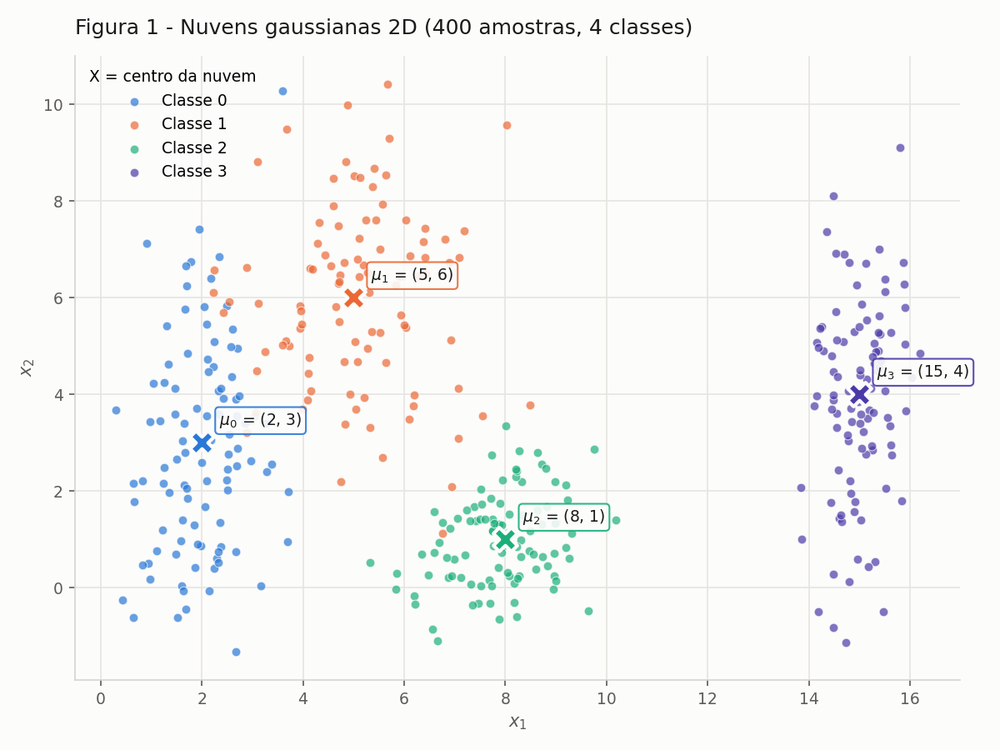
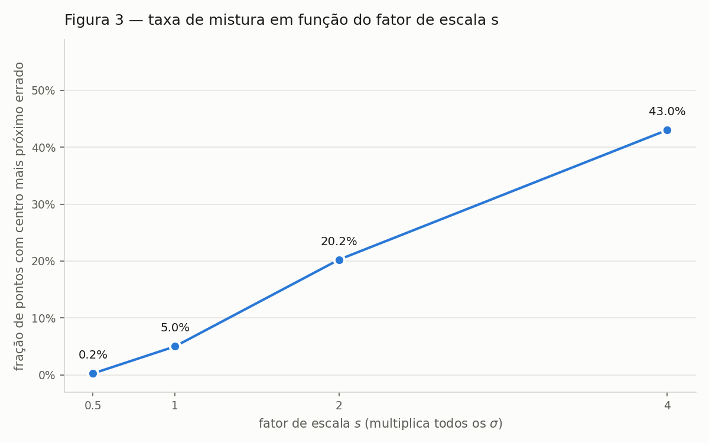
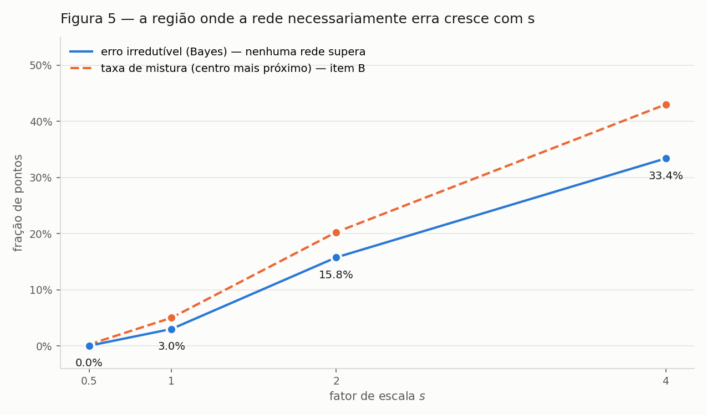
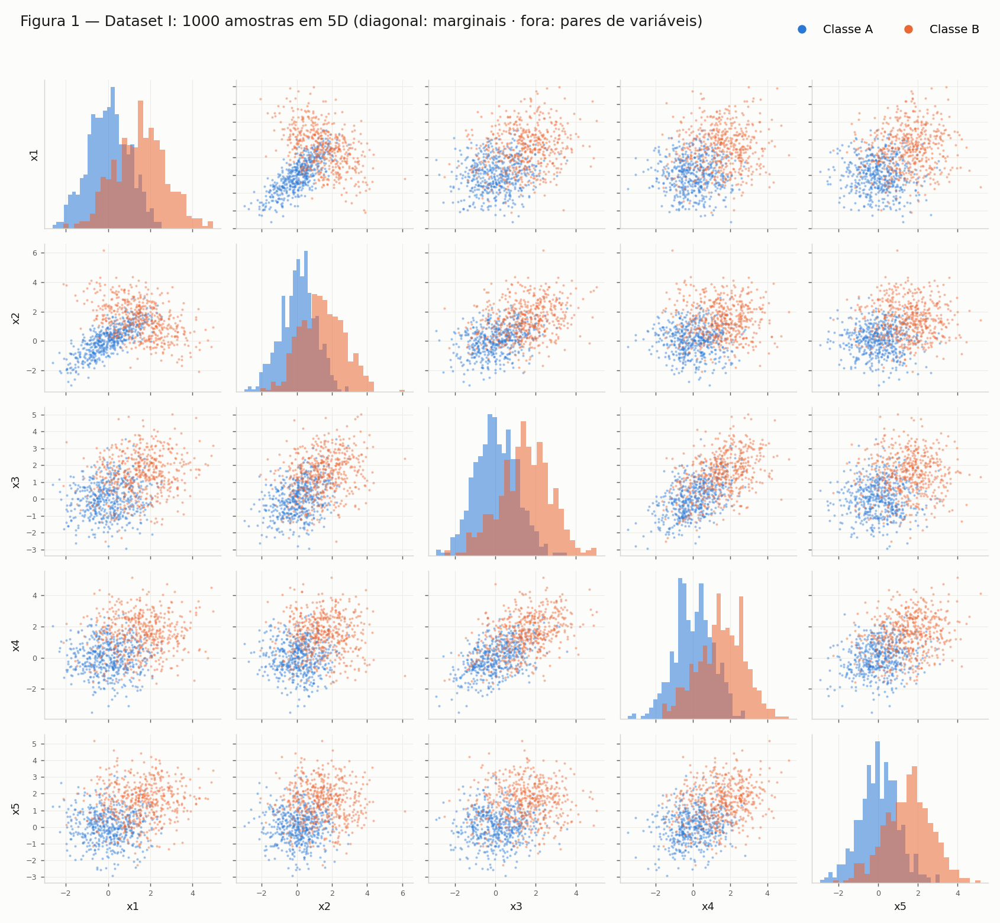
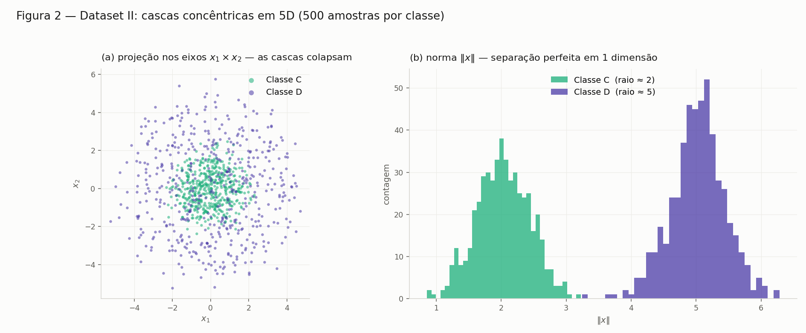
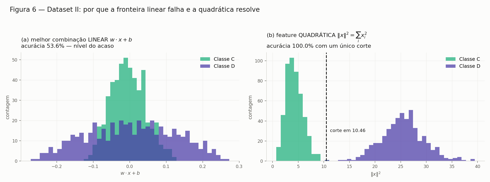

# Dados: geometria, não-linearidade e pré-processamento

Três exercícios sobre a pergunta que antecede a escolha de qualquer arquitetura: **que forma têm os dados, e que tipo de fronteira essa forma exige?** O primeiro mede espalhamento em 2D, o segundo contrasta separabilidade linear e radial em 5D, e o terceiro leva a mesma lógica para um dataset real que precisa entrar numa rede com ativação `tanh`.

Todo o código está em `code/` e roda com semente fixa (`SEED = 42`); as figuras em `figures/` são exatamente as que os scripts produzem.

!!! info "Como reproduzir"

    ```bash
    pip install -r requirements.txt
    cd docs/exercises/data/code
    python3 ex1_nuvens.py && python3 ex1b_espalhamento.py && python3 ex1c_analise.py
    python3 ex2_dataset1.py && python3 ex2_dataset2.py && python3 ex2c_pca.py && python3 ex2d_analise.py
    python3 ex3a_conhecer.py && python3 ex3bcd_preprocessa.py
    ```

    O `train.csv` do Exercício 3 vem da competição [Spaceship Titanic](https://www.kaggle.com/competitions/spaceship-titanic/data) e está versionado em `data/`.

---

## Exercício 1

**Abordagem.** Gerei quatro nuvens gaussianas 2D com as médias e desvios dados, medi a separação entre elas com uma razão adimensional, e repeti a geração inflando todos os desvios por um fator de escala `s`. A pergunta guia é quando a separabilidade linear se perde — e montei a medição para que essa perda tivesse um marcador numérico, não apenas visual.

### A — Gere as nuvens

Cada classe recebeu 100 amostras de `rng.normal(loc=μ, scale=σ, size=(100,2))` — covariância diagonal, cada eixo com seu próprio desvio e sem correlação entre `x₁` e `x₂`.

| Classe | μ teórico | μ amostral | σ teórico | σ amostral |
|---|---|---|---|---|
| 0 | (2, 3) | (1.99, 2.89) | (0.8, 2.5) | (0.73, 2.14) |
| 1 | (5, 6) | (5.07, 5.97) | (1.2, 1.9) | (1.28, 1.86) |
| 2 | (8, 1) | (7.90, 0.98) | (0.9, 0.9) | (0.91, 0.92) |
| 3 | (15, 4) | (14.99, 3.88) | (0.5, 2.0) | (0.52, 2.02) |

A maior discrepância é o σ de `x₂` da classe 0 (2.14 contra 2.5) — flutuação amostral esperada com n = 100.



**Figura 1** — as 400 amostras, uma cor por classe, com a média de cada nuvem marcada com **×** e rotulada. As classes 0 e 1 se sobrepõem na faixa `x₁ ≈ 3–4`; a classe 3 está isolada em `x₁ ≈ 15`.

### B — Mais ou menos espalhado

As mesmas quatro classes, geradas quatro vezes com todos os desvios multiplicados por `s ∈ {0.5, 1, 2, 4}`. Um detalhe de implementação torna a comparação limpa: sorteio o mesmo ruído normal padrão `z` com a semente fixa e faço `μ + z·(σ·s)`, de modo que as quatro versões são literalmente a mesma nuvem inflada — a diferença entre os painéis é só o `s`, sem ruído de sorteio.


**Figura 2** — os quatro datasets com **eixos compartilhados**, para que a comparação seja honesta.

#### Razão de separação (s = 1)

`rᵢⱼ = ‖μᵢ − μⱼ‖ / (σ̄ᵢ + σ̄ⱼ)`, com `σ̄ₖ = (σₖ,ₓ + σₖ,ᵧ)/2`:

| Par (i, j) | ‖μᵢ − μⱼ‖ | σ̄ᵢ + σ̄ⱼ | rᵢⱼ |
|---|---|---|---|
| **(0, 1)** | 4.243 | 3.20 | **1.326** ← menor |
| (1, 2) | 5.831 | 2.45 | 2.380 |
| (0, 2) | 6.325 | 2.55 | 2.480 |
| (2, 3) | 7.616 | 2.15 | 3.542 |
| (1, 3) | 10.198 | 2.80 | 3.642 |
| (0, 3) | 13.038 | 2.90 | 4.496 |

O menor é o par **(0, 1)**: são os dois centros mais próximos (4.24) e, ao mesmo tempo, as duas nuvens mais gordas (σ̄ = 1.65 e 1.55).

Como as médias não mudam, o numerador é constante e o denominador escala com `s`, então `rᵢⱼ(s) = rᵢⱼ(1)/s`. **Em s = 2: r₀₁ = 1.326 / 2 = 0.663** — sem gerar nada.

#### Taxa de mistura

Fração de pontos cujo centro de classe mais próximo não é o da própria classe — medida puramente geométrica, sem treinar nada: a distância de cada ponto às quatro médias sai de um único *broadcasting* `(N,1,2) − (1,4,2)`.

| s | Taxa de mistura | menor rᵢⱼ | Por classe |
|---|---|---|---|
| 0.5 | 0.25% | 2.652 | C0 1%, demais 0% |
| 1.0 | 5.00% | 1.326 | C0 8%, C1 12%, C2/C3 0% |
| 2.0 | 20.25% | **0.663** | C0 31%, C1 38%, C2 7%, C3 5% |
| 4.0 | 43.00% | 0.331 | C0 51%, C1 56%, C2 43%, C3 22% |



**Figura 3** — taxa de mistura × fator de escala. O salto entre s = 1 e s = 2 é onde o problema muda de natureza.

!!! success "A partir de qual fator de escala as nuvens deixam de poder ser separadas por retas?"

    **A partir de s = 2.** Em s = 0.5 e s = 1 ainda dá: os 5% de mistura em s = 1 são pontos de borda entre as classes 0 e 1, e as outras três fronteiras continuam limpas — um conjunto de retas erra pouco. Em s = 2 as nuvens 0 e 1 se interpenetram (31% e 38% de mistura) e a classe 2 já invade as duas; não existe reta que separe 0 de 1, porque não há mais uma região de baixa densidade entre elas. Em s = 4 é caos: 43% de mistura, com o acaso puro em 75%.

    **E o menor rᵢⱼ nesse ponto? Ele cruza 1.** r₀₁ vai de 1.326 para 0.663: a distância entre os centros passa a ser *menor* que a soma dos espalhamentos, ou seja, cada nuvem alcança fisicamente o centro da outra. **r ≈ 1 é o limiar geométrico** entre "separável por reta" e "sobreposto" — exatamente onde a mistura sai do regime de bordas (5%) e vira estrutural (20%).

### C — Análise

A sobreposição no dataset original **não é uniforme, é concentrada em um só lugar**. O par **(0, 1)** ocupa de fato a mesma faixa `x₁ ≈ 3–4`; as classes 1 e 2 só se tocam pelas caudas (r = 2.38); 0 e 2 são quase disjuntas (r = 2.48); e a classe 3 está isolada, com um vazio de ~4 unidades em `x₁` separando-a da nuvem 2.

!!! success "Uma única fronteira linear separaria todas as classes? E um conjunto de fronteiras lineares?"

    **Uma só, não** — por dois motivos independentes. Primeiro, uma reta divide o plano em **duas** regiões e são **quatro** classes: é impossível por geometria, quaisquer que fossem os dados. Segundo, mesmo o subproblema binário mais fácil aqui (0 contra 1) não tem solução exata por reta, porque as duas nuvens se interpenetram.

    **Um conjunto de retas, quase.** Três retas bem posicionadas — uma vertical em `x₁ ≈ 12` isolando a classe 3, uma separando a 2 das demais, uma na diagonal entre 0 e 1 — chegam a ~95% de acerto. É exatamente o que faz a partição por centro mais próximo: **5.0% de erro**. O que sobra é a região 0∩1, que nenhum arranjo de retas resolve. O resíduo não é falta de capacidade do modelo, é sobreposição das distribuições.


**Figura A1** — o esboço das fronteiras sobre os dados do item A. À esquerda, a partição de Voronoi das quatro médias: retas, o que uma camada softmax traça (**5.0% de erro**). À direita, a fronteira ótima de Bayes: como as covariâncias diferem entre classes, ela é **curva** (**3.2% de erro**). Os círculos pretos marcam os pontos do lado errado — quase todos na faixa entre as classes 0 e 1.

O ganho de 5.0% para 3.2% é precisamente o que a não-linearidade compra neste dataset: a fronteira ótima encurva para envolver a nuvem 2, que é compacta, e estreita a região da classe 0 em `x₂` alto — coisas que nenhuma reta faz.

Para quantificar o que é irredutível, calculei o **erro de Bayes** por Monte Carlo (200 000 amostras da distribuição verdadeira, classificadas pelo argmax da densidade real). É o piso: nenhuma arquitetura, nenhum treino e nenhum volume de dados fica abaixo dele.

| s | Erro de Bayes | Taxa de mistura | menor rᵢⱼ |
|---|---|---|---|
| 0.5 | 0.02% | 0.25% | 2.652 |
| 1.0 | 3.00% | 5.00% | 1.326 |
| 2.0 | 15.75% | 20.25% | 0.663 |
| 4.0 | 33.38% | 43.00% | 0.331 |



**Figura A2** — a curva azul é o piso irredutível; a laranja é a mistura geométrica do item B. A distância entre as duas é a única coisa que a escolha de arquitetura controla.

!!! success "Quanto mais espalhadas as nuvens, o que acontece com a região onde a rede necessariamente erra?"

    Ela cresce de duas maneiras ao mesmo tempo. **Em área:** deixa de ser uma fita fina entre duas nuvens e vira uma região larga — de praticamente medida nula em s = 0.5 (0.02% de erro) a um terço do plano ocupado em s = 4 (33.38%). **Em número de pares envolvidos:** em s = 1 só o par (0, 1) contribui, com as classes 2 e 3 em 0% de erro; em s = 4 até a classe 3, a mais isolada, erra 22% — a sobreposição deixou de ser local e virou global.

    O elo com o item B é direto: **rᵢⱼ mede a largura dessa região**. Enquanto r > 1 existe um vale de baixa densidade onde pôr a fronteira; quando r₀₁ cruza 1, o vale desaparece e qualquer fronteira — reta, curva ou uma rede de dez camadas — corta densidade alta dos dois lados. Aumentar capacidade em s = 4 não é resolver o problema, é decorar ruído.

### Código do Exercício 1

??? example "code/ex1_nuvens.py — geração das nuvens e Figura 1"

    ```python
    --8<-- "docs/exercises/data/code/ex1_nuvens.py"
    ```

??? example "code/ex1b_espalhamento.py — escalas, rᵢⱼ, taxa de mistura, Figuras 2 e 3"

    ```python
    --8<-- "docs/exercises/data/code/ex1b_espalhamento.py"
    ```

??? example "code/ex1c_analise.py — fronteiras, erro de Bayes, Figuras A1 e A2"

    ```python
    --8<-- "docs/exercises/data/code/ex1c_analise.py"
    ```

---

## Exercício 2

**Abordagem.** Dois datasets 5D com estruturas deliberadamente opostas — um separável por posição, outro por escala — e a comparação do que sobrevive a uma projeção linear. A PCA foi implementada à mão por SVD, e cada afirmação da análise final foi verificada com um classificador rodando, não só argumentada.

### A — Dataset I: gaussianas deslocadas

500 amostras por classe de uma normal multivariada 5D. A classe A tem μ = 0 e correlações positivas (0.8 entre `x₁`–`x₂`); a classe B tem μ = 1.5 em todos os eixos, variâncias 1.5 e `x₁`–`x₂` **anti**correlacionados (−0.7).

Antes de gerar, validei as duas matrizes — uma covariância precisa ser simétrica e positiva definida, senão a distribuição não existe:

| | Simétrica | Autovalores | Positiva definida |
|---|---|---|---|
| Σ_A | sim | 0.158, 0.468, 0.990, 1.458, 1.927 | ✅ |
| Σ_B | sim | 0.498, 1.025, 1.542, 2.124, 2.312 | ✅ |

O autovalor mínimo de Σ_A é pequeno justamente por causa da correlação 0.8, que deixa a nuvem quase achatada nessa direção.

**Conferência amostral:** média de A = (0.026, 0.085, 0.037, 0.019, 0.035) contra 0; média de B = (1.524, 1.452, 1.473, 1.519, 1.530) contra 1.5. Erro máximo entre a covariância amostral e Σ: 0.086 (A) e 0.137 (B).



**Figura A3** — matriz de dispersão do Dataset I: na diagonal, as marginais; fora dela, os pares de variáveis.

Duas leituras importam. As **marginais se sobrepõem muito**: um deslocamento de 1.5 com σ entre 1.0 e 1.22 não separa nada sozinho — só a combinação das cinco dimensões separa. E a **inversão de sinal da correlação `x₁`–`x₂`** (+0.8 em A, −0.7 em B) faz as duas elipses se cruzarem em X naquele painel: é informação de *forma*, não de posição, que uma fronteira linear não aproveita e uma quadrática sim.

### B — Dataset II: cascas concêntricas

Mesmo tamanho, mesma dimensão, estrutura radial: direção `u = v/‖v‖` com `v ~ N(0, I₅)`, o que dá uma direção uniforme na esfera unitária; raio `ρ ~ N(2.0, 0.4)` para a classe C e `N(5.0, 0.4)` para a D; e `x = ρ·u`.

!!! note "Ambiguidade do enunciado"

    O enunciado escreve `ρ ~ N(2.0, 0.4)` sem dizer se 0.4 é desvio ou variância. Adotei **desvio padrão** — a leitura que casa com o Exercício 1 — e isolei a escolha na constante `SIGMA_RHO`. As cascas não se tocam em nenhuma das duas leituras.

| Classe | Raio médio (alvo) | Desvio do raio | Desvio por eixo | Esperado ρ/√5 |
|---|---|---|---|---|
| C | 2.027 (2.0) | 0.405 | ≈ 0.92 | 0.894 |
| D | 5.026 (5.0) | 0.421 | ≈ 2.26 | 2.236 |

A média por eixo dá ≈ 0 nas duas classes, como esperado de uma direção isotrópica, e o desvio por eixo bate com `ρ/√5` — a variância do raio se reparte igualmente entre as cinco coordenadas. **As cascas não se tocam:** o maior raio de C é 3.224 e o menor de D é 3.244, então o corte `‖x‖ = 3.234` separa as duas classes com **0% de erro**.



**Figura A4** — o contraste central do Dataset II. À esquerda, a projeção em dois eixos: a classe D **não** aparece como um anel, porque em 5D projetar uma casca sobre duas coordenadas preenche o disco — D cobre inteiramente C. À direita, a norma `‖x‖`, uma única dimensão derivada, separa perfeitamente.


**Figura A5** — os vinte painéis de pares de eixos originais. Em todos, a nuvem de D envolve a de C: nenhum par de coordenadas separa as classes.

**Diferença estrutural em relação ao Dataset I.** Lá as classes têm médias diferentes, então existe uma direção `w` em que as projeções se afastam. Aqui as duas classes têm a **mesma média (zero)**: qualquer hiperplano `w·x + b` recebe as duas distribuições centradas no mesmo ponto. A não-linearidade deixa de ser um ganho marginal e vira a única saída.

### C — Visualize e compare

PCA por SVD sobre os dados centrados (não padronizados — as escalas já são comparáveis), aplicada aos dois datasets e plotada lado a lado.


**Figura 4** — projeção PCA em 2D dos dois datasets. No Dataset I as classes se separam ao longo de PC1; no Dataset II a projeção vira dois discos concêntricos, com C afogada dentro de D.

| Dataset | PC1 | PC2 | PC3 | PC4 | PC5 | **PC1+PC2** |
|---|---|---|---|---|---|---|
| I — gaussianas | 51.3% | 15.8% | 14.4% | 12.5% | 6.0% | **67.0%** |
| II — cascas | 22.4% | 20.8% | 20.6% | 19.0% | 17.1% | **43.2%** |

!!! success "Em qual dos datasets a projeção 2D preserva melhor a informação relevante para a classificação?"

    **No Dataset I** — por dois motivos que vale separar.

    **Quantidade:** 67.0% contra 43.2%. No Dataset I existem direções privilegiadas (as correlações fortes das duas covariâncias, mais o deslocamento das médias) e a variância se concentra em PC1. No Dataset II o espectro é *plano*, ≈ 20% em cada componente: a distribuição é isotrópica, nenhuma direção é especial, e 43.2% é praticamente o 2/5 = 40% que se obteria escolhendo dois eixos ao acaso.

    **Qualidade — que é o ponto:** variância explicada não é a mesma coisa que informação para classificar. No Dataset I a direção de maior variância coincide com a direção que separa as classes (μ_B − μ_A aponta para [1,1,1,1,1]), então PC1 sozinho já quase resolve. No Dataset II a informação discriminante está em `‖x‖² = Σxᵢ²`, uma função **quadrática de todas as cinco coordenadas** — nenhuma projeção linear 2D a preserva. Ao descartar 3 eixos, o raio projetado vira um subestimador ruidoso do raio real e as cascas borram uma sobre a outra. A PCA não falhou por escolher mal os componentes: **não existe projeção linear 2D boa**.

#### Medidas em 5D

| Dataset | ‖μ₁ − μ₂‖ | Raio classe 1 | Raio classe 2 | Sobreposição dos raios |
|---|---|---|---|---|
| I (A, B) | **3.264** (teórico 1.5·√5 = 3.354) | 2.109 ± 0.788 | 4.175 ± 1.161 | 79.6% |
| II (C, D) | **0.159** (teórico 0) | 2.027 ± 0.405 | 5.026 ± 0.421 | **0.0%** |

"Sobreposição" é a fração de amostras na faixa de raios onde as duas classes coexistem.


**Figura 5** — histograma do raio `‖x‖` com as duas classes sobrepostas no mesmo eixo, por dataset.

- **Dataset I:** centros bem separados (3.26), mas os raios se misturam em 79.6% — a classe A tem pontos longe da origem e a B tem pontos perto. O raio ainda carrega sinal parcial (um corte em `‖x‖` acerta 86.3%), mas fica **abaixo** da fronteira linear (88.7%): a feature certa aqui é a projeção numa direção, não a distância à origem.
- **Dataset II:** centros coincidentes (0.159 é ruído amostral com n = 500), então nenhuma direção separa — mas os raios não se tocam. O raio é a feature perfeita.

### D — Análise

!!! success "No Dataset II a distância entre os centros é ≈ 0 mas os histogramas de raio ficam separados. O que isso diz sobre separar as classes com um hiperplano?"

    Diz que **as classes são perfeitamente separáveis, mas não por um hiperplano** — a informação que as distingue não é do tipo que um hiperplano consegue ler.

    Um hiperplano decide por `w·x + b > 0`: ele só enxerga o dado através da **projeção escalar `w·x`**, uma única direção. Como os centros coincidem (‖μ_C − μ_D‖ = 0.159 ≈ 0) e as duas distribuições são esfericamente simétricas em torno da origem, `w·x` é simétrico em torno de zero nas **duas** classes, para **qualquer** `w` — elas diferem apenas na **largura** (desvio `ρ/√5`: 0.89 para C, 2.24 para D), não na posição, e um limiar não distingue "estreito" de "largo". A informação existe, mas está em `‖x‖`, que depende de todas as coordenadas e de forma quadrática: é informação de *escala*, e projeção escalar destrói escala.

    Medido: a regressão logística sobre as 5 coordenadas cruas atinge **88.7%** no Dataset I e **53.6%** no Dataset II.

!!! success "Por que a estrutura do Dataset II não pode ser resolvida por uma fronteira linear, por mais dados que se colete?"

    Porque o limite **não é estatístico, é representacional**. Mais dados reduzem a incerteza sobre os parâmetros de uma fronteira; não mudam o conjunto de fronteiras que a família consegue expressar. O conjunto separador verdadeiro é `{x : ‖x‖ < 3.23}`, uma **hiperesfera** — região limitada e fechada. Um semiespaço `{x : w·x + b > 0}` é ilimitado em todas as direções perpendiculares a `w`. Nenhum semiespaço é uma bola, e isso é uma afirmação de geometria: independe de quantas amostras existam.

    | n por classe | Regressão logística | Melhor hiperplano possível |
    |---|---|---|
    | 500 | 53.4% | 63.5% |
    | 2 000 | 52.1% | 63.2% |
    | 10 000 | 51.0% | 62.1% |
    | 50 000 | 50.5% | 61.9% |

    A segunda coluna é o **teto** de qualquer hiperplano: varri direções aleatórias e, para cada uma, todos os cortes possíveis. Ele fica em ~62% e **não sobe com mais dados** — vem de um truque degenerado: cortar longe do centro, onde só existem pontos de D, porque a classe mais espalhada tem caudas mais longas. É o máximo que a geometria de um semiespaço arranca de duas esferas concêntricas, e continua a 38 pontos percentuais da solução. A regressão logística fica *abaixo* desse teto porque otimiza log-loss, e o ótimo de log-loss no problema simétrico é literalmente `w = 0`.

!!! success "Uma projeção 2D em que as classes parecem misturadas prova que elas são inseparáveis no espaço original?"

    **Não.** A implicação só vale num sentido:

    - a projeção **separa** ⟹ o espaço original separa (a projeção é uma função dos dados; compor essa função com o corte é um classificador válido em 5D);
    - a projeção **não separa** ⟹ **nada** se conclui sobre o espaço original.

    A PCA torna esse falso negativo ainda mais provável, por ser **linear** (só faz combinações `Σaᵢxᵢ`, nunca produtos ou quadrados) e **não supervisionada** (maximiza variância total sem olhar os rótulos — ela nem sabe que existem classes).

    Justificando com os resultados deste exercício, o Dataset II é o contraexemplo completo: PC1+PC2 explicam **43.2%** com as classes visualmente misturadas (Figura 4) e os vinte painéis da Figura A5 não separam nada; e ainda assim a sobreposição dos raios é **0%** e um único corte acerta **100%**. A projeção falhou, não os dados.

#### A função que separa o Dataset II

```
f(x) = x₁² + x₂² + x₃² + x₄² + x₅² − 10.46        (10.46 = 3.234²)

f(x) < 0  →  Classe C          f(x) > 0  →  Classe D          acurácia: 100.0%
```

O limiar é o quadrado do ponto médio entre o maior raio de C (3.224) e o menor de D (3.244).



**Figura A6** — à esquerda, a melhor combinação linear empilha as duas classes em torno de zero; só as larguras diferem. À direita, em coordenadas quadráticas, viram dois montes disjuntos com um corte trivial entre eles.

O detalhe que interessa para redes neurais: `f` é uma função **linear** das features transformadas `z = (x₁², …, x₅²)` — é o mesmo hiperplano `w·z + b` com `w = [1,1,1,1,1]` e `b = −10.46`. O problema nunca foi precisar de uma fronteira exótica; era que a fronteira é linear no espaço **errado**. É exatamente o que uma camada oculta faz: aprende uma transformação `z = φ(x)` que torna o problema linearmente separável, e a camada de saída traça o hiperplano.

| Dataset | ‖μ₁ − μ₂‖ | Acurácia linear | Acurácia com ‖x‖² | Fronteira necessária |
|---|---|---|---|---|
| I | 3.264 | **88.7%** | 86.3% | hiperplano |
| II | 0.159 | 53.6% (teto 62%) | **100.0%** | hiperesfera |

As duas colunas do meio trocam de vencedor entre as linhas: a mesma feature que resolve um dataset é a pior escolha para o outro.

### Código do Exercício 2

??? example "code/ex2_dataset1.py — gaussianas 5D e Figura A3"

    ```python
    --8<-- "docs/exercises/data/code/ex2_dataset1.py"
    ```

??? example "code/ex2_dataset2.py — cascas concêntricas, Figuras A4 e A5"

    ```python
    --8<-- "docs/exercises/data/code/ex2_dataset2.py"
    ```

??? example "code/ex2c_pca.py — PCA por SVD, Figuras 4 e 5"

    ```python
    --8<-- "docs/exercises/data/code/ex2c_pca.py"
    ```

??? example "code/ex2d_analise.py — regressão logística, teto do hiperplano, Figura A6"

    ```python
    --8<-- "docs/exercises/data/code/ex2d_analise.py"
    ```

---

## Exercício 3

**Abordagem.** Dataset Spaceship Titanic (Kaggle, `train.csv`). Primeiro caracterizei os dados e a assimetria dos gastos; depois separei treino e teste *antes* de qualquer estatística; e só então montei um pré-processador que aprende tudo no treino e é apenas aplicado no teste. O critério de todas as escolhas foi a mesma pergunta: isso deixa as entradas na faixa onde a `tanh` ainda tem gradiente?

### A — Conheça os dados

`train.csv`: **8 693 linhas × 14 colunas**.

**Objetivo e alvo.** A nave *Spaceship Titanic* colidiu com uma anomalia espaço-temporal e parte dos passageiros foi transportada para outra dimensão. `Transported` é o alvo booleano — `True` significa transportado — e não tem nenhum valor faltante. É uma **classificação binária**.

**Balanceamento:** 4 378 `True` (**50.36%**) contra 4 315 `False` (49.64%), razão de **1.015 : 1**. Praticamente perfeito, o que tem consequências práticas: acurácia é métrica honesta aqui (o baseline burro acerta 50.4%, não 90%), não é preciso ponderar classes nem reamostrar, e a saída pode ser um único neurônio sigmoide sem ajuste de limiar.

#### Features por tipo

| Tipo | Colunas | Observação |
|---|---|---|
| **Numéricas (6)** | `Age`; `RoomService`, `FoodCourt`, `ShoppingMall`, `Spa`, `VRDeck` | `Age` vai de 0 a 79; os gastos, de 0 a 29 813 |
| **Categóricas (5)** | `HomePlanet` (3), `Destination` (3), `CryoSleep` (2), `VIP` (2), `Cabin` (6 560) | `Cabin` é composta: `deck/num/side` |
| **Identificadores (2)** | `PassengerId`, `Name` | fora do modelo |

Três achados estruturais que já apontam para o pré-processamento:

- **`Cabin` não é uma categórica comum.** Com 6 560 valores distintos em 8 693 linhas, um one-hot direto criaria mais colunas que linhas. Ela é composta — deck ∈ {A…G, T}, num ∈ [0, 1894], side ∈ {P, S}.
- **`PassengerId` tem estrutura** (`gggg_pp`): são 6 217 grupos para 8 693 passageiros, ou seja, muita gente viaja acompanhada.
- **`CryoSleep` domina os gastos:** dos 3 037 passageiros em criosono, **exatamente zero** consumiram qualquer coisa — e 81.8% deles foram transportados, contra 32.9% dos demais.

#### Valores faltantes

| Coluna | Faltantes | % | Coluna | Faltantes | % |
|---|---|---|---|---|---|
| `CryoSleep` | 217 | 2.50% | `FoodCourt` | 183 | 2.11% |
| `ShoppingMall` | 208 | 2.39% | `Spa` | 183 | 2.11% |
| `VIP` | 203 | 2.34% | `Destination` | 182 | 2.09% |
| `HomePlanet` | 201 | 2.31% | `RoomService` | 181 | 2.08% |
| `Name` | 200 | 2.30% | `Age` | 179 | 2.06% |
| `Cabin` | 199 | 2.29% | `PassengerId` | 0 | 0.00% |
| `VRDeck` | 188 | 2.16% | `Transported` | 0 | 0.00% |

Coluna a coluna o problema é pequeno — nenhuma passa de 2.5%, e a taxa é notavelmente uniforme, o que sugere ausência aleatória e não uma coluna quebrada. **Linha a linha o problema é grande:** só **75.99%** das linhas estão completas, porque os buracos estão espalhados por doze colunas e raramente coincidem. Um `dropna()` custaria **2 087 passageiros** — um em cada quatro — para resolver buracos que somam ~2% dos valores. **Imputar é obrigatório**, não preferência de estilo.

#### Colunas de gasto

| Coluna | Média | Mediana | Máximo | Desvio | % zeros | Assimetria |
|---|---|---|---|---|---|---|
| `RoomService` | 224.69 | **0.00** | 14 327 | 666.72 | 64.2% | 6.33 |
| `FoodCourt` | 458.08 | **0.00** | 29 813 | 1 611.49 | 62.8% | 7.10 |
| `ShoppingMall` | 173.73 | **0.00** | 23 492 | 604.70 | 64.3% | 12.63 |
| `Spa` | 311.14 | **0.00** | 22 408 | 1 136.71 | 61.2% | 7.64 |
| `VRDeck` | 304.85 | **0.00** | 24 133 | 1 145.72 | 63.2% | 7.82 |

Como a mediana é zero em todas, a razão média/mediana não existe. Refazendo apenas **entre quem gastou** (valor > 0), a média fica de **2.0 a 3.7 vezes** a mediana:

| Coluna | n (gastaram) | Média | Mediana | Média/mediana | % do gasto total |
|---|---|---|---|---|---|
| `RoomService` | 2 935 | 651.63 | 320.00 | 2.04 | 15.3% |
| `FoodCourt` | 3 054 | 1 276.44 | 396.50 | **3.22** | 31.1% |
| `ShoppingMall` | 2 898 | 508.66 | 195.00 | 2.61 | 11.8% |
| `Spa` | 3 186 | 831.07 | 226.50 | **3.67** | 21.1% |
| `VRDeck` | 3 010 | 861.39 | 260.00 | **3.31** | 20.7% |


**Figura A7** — as cinco distribuições de gasto em escala `log(1+x)`, com a média em laranja e a mediana tracejada. Sem o log, tudo colapsa numa única barra em zero.

!!! success "Compare média e mediana: o que essa diferença indica sobre espalhamento e assimetria?"

    Que as distribuições são **fortemente assimétricas à direita, com cauda longa** — e que a média não descreve nenhum passageiro típico. Três fatos sustentam isso:

    1. **Assimetria positiva extrema.** O coeficiente vai de **6.33 a 12.63** (uma normal tem 0; acima de 1 já se considera muito assimétrico). A média é puxada por poucos valores enormes: em `FoodCourt`, o máximo (29 813) é **65 vezes a média** e está **18 desvios-padrão** acima dela.
    2. **São duas populações misturadas.** A Figura A7 é bimodal: uma pilha de zeros (~63%, boa parte explicada pelo criosono) e um monte de gastadores. A média de 458 cai num vale onde quase ninguém está — ninguém é "médio" aqui.
    3. **O espalhamento é dominado pela cauda.** O desvio-padrão supera a média em todas as colunas (`FoodCourt`: 1 611 contra 458, coeficiente de variação 3.5), e **10% dos passageiros respondem por 55.9%** de todo o gasto da nave (o 1% maior já responde por 13.6%).

### B — Separe antes de transformar

```
treino:  6 954 linhas (80.0%) | Transported=True: 50.36%
teste :  1 739 linhas (20.0%) | Transported=True: 50.37%
dataset completo:                              50.36%
```

Split 80/20 **estratificado** pelo alvo com semente fixa (`SEED = 42`), implementado embaralhando os índices dentro de cada classe e cortando 20% de cada uma — o que preserva a proporção de `True` nos dois lados com diferença de uma única linha.

!!! success "Por que essa separação vem antes da imputação e do escalonamento"

    Porque o conjunto de teste existe para **simular dados que o modelo nunca viu**, e essa simulação só é honesta se nenhuma informação do teste tiver influenciado o treino. Se a mediana da imputação, a média e o desvio do escalonamento ou a lista de categorias do one-hot forem calculados sobre o dataset inteiro, cada uma dessas estatísticas carrega um resumo das linhas de teste para dentro do pré-processador, e o modelo passa a treinar com um traço do teste embutido nas features.

    O resultado é uma métrica **otimista demais**, que não se repete em produção, onde os dados novos de fato não participaram do cálculo de nada. Concretamente: aqui tudo é aprendido em `pp.fit(treino)` e apenas aplicado em `pp.transform(teste)`.

### C — Pré-processe

#### C.1 — Dados faltantes: uma estratégia por tipo

| Tipo | Estratégia | Justificativa |
|---|---|---|
| **Numéricas** (`Age` + 5 gastos) | **mediana do treino** | As distribuições de gasto têm assimetria de 6 a 12 e a média é puxada pela cauda; a mediana é robusta a outliers e não inventa um valor que ninguém tem. Para `Age` ela é 27; para os gastos é **0**, que é também a moda (>61% de zeros) e o valor estruturalmente correto de quem está em criosono. |
| **Categóricas** (`HomePlanet`, `CryoSleep`, `Destination`, `VIP`) | **nível explícito `Desconhecido`** | Preencher com a moda finge uma certeza que não existe e distorce as frequências — `VIP` viraria 100% `False`. Um nível próprio preserva a informação "esse dado faltou", que pode ser preditiva, e o one-hot já lida com isso sem custo. |

#### C.2 — Features categóricas: one-hot

| Coluna | Colunas geradas |
|---|---|
| `HomePlanet` | Earth, Europa, Mars, Desconhecido (4) |
| `Destination` | 55 Cancri e, PSO J318.5-22, TRAPPIST-1e, Desconhecido (4) |
| `CryoSleep` | False, True, Desconhecido (3) |
| `VIP` | False, True, Desconhecido (3) |

Mantive **todas** as categorias (sem `drop_first`): uma rede neural não sofre com a colinearidade que incomoda uma regressão linear, e a coluna completa torna inequívoco o tratamento abaixo.

!!! success "Como o código trata uma categoria que aparece no teste mas não no treino"

    A lista de categorias é congelada no `fit`, e o `transform` constrói as colunas por comparação (`v == categoria`) sobre essa lista fixa. Uma categoria nova simplesmente não casa com nenhuma e produz **uma linha de zeros** naquele bloco. Testei injetando `HomePlanet = "Titan"` no teste:

    ```
     HomePlanet=Earth  HomePlanet=Europa  HomePlanet=Mars  HomePlanet=Desconhecido
                  0.0                0.0              0.0                      0.0
    ```

    É o comportamento desejado por três motivos: **não quebra** (nenhuma exceção), **não cria coluna nova** — o `shape` do teste continua igual ao do treino, o que é obrigatório para a matriz entrar na rede — e é **semanticamente honesto**: "não é nenhuma das origens conhecidas" é exatamente o que a rede deve receber. O custo é que `Titan` fica indistinguível de outra origem desconhecida; se isso importasse, bastaria mapear categorias raras para `Desconhecido` já no treino.

#### C.3 — Engenharia de features

`TotalSpend` é a soma das cinco colunas de gasto, calculada **depois** da imputação — senão um único NaN contaminaria a soma inteira. Ela resume em uma variável "esse passageiro consumiu algo a bordo?", que o item A mostrou ser o eixo mais informativo, e dá à rede o sinal agregado sem depender de ela somar cinco entradas sozinha.

Descartadas: `PassengerId` e `Name` (identificadores — memorizá-los é overfitting puro) e `Cabin` (cardinalidade 6 560). Registro que `Cabin` não é lixo: dividida em `deck/num/side` renderia três features de baixa cardinalidade, e é o próximo ganho fácil.

#### C.4 — Cauda pesada: log(1 + x)

Aplicado às cinco colunas de gasto e a `TotalSpend`. `Age` não precisa — assimetria 0.42, já bem-comportada. Efeito medido em `FoodCourt`: **assimetria 7.19 → 1.14**, faixa `[0, 29 813] → [0, 10.3]`.

!!! success "Por que essa transformação ajuda uma rede com tanh?"

    A `tanh` só é informativa perto da origem: em ±2 ela já entrega ±0.96 e sua derivada caiu para ~0.07; em ±3, ~0.01. Uma entrada gigante empurra a pré-ativação para essa zona plana, o gradiente tende a zero e **o neurônio para de aprender**.

    O ponto crítico é que **padronizar sozinho não resolve**: o z-score é uma transformação *linear*, e transformação linear não altera assimetria. O máximo de `FoodCourt` cru padronizado daria `(29 813 − 458)/1 611 = 18.2` — nove vezes além do ponto de saturação — enquanto 63% dos passageiros ficariam amontoados em −0.28.

    O `log1p` é *não-linear* e comprime a cauda de forma desproporcional: quem gastou 30 000 e quem gastou 3 000 passam a distar 2.3 unidades em vez de 27 000, o que transforma uma razão numa distância. E `log1p(0) = 0`, então os zeros não precisam de tratamento à parte, e a diferença entre gastar 0 e 100 vira comparável à diferença entre gastar 1 000 e 10 000 — que é o que faz sentido para um consumo.

#### C.5 — Escalonamento: padronização (z-score)

Média 0 e desvio 1, calculados no treino e aplicados nos dois conjuntos.

| Coluna | Mínimo | Máximo |
|---|---|---|
| `Age` | −2.015 | 3.502 |
| `RoomService` | −0.643 | 2.874 |
| `FoodCourt` | −0.650 | 2.855 |
| `ShoppingMall` | −0.625 | 3.032 |
| `Spa` | −0.665 | 2.959 |
| `VRDeck` | −0.644 | 3.008 |
| `TotalSpend` | −1.155 | 1.687 |
| colunas one-hot | 0.000 | 1.000 |

**Mínimo global −2.015, máximo global 3.502** (no teste: −2.015 a 3.432).

!!! success "Por que z-score e não normalização para [−1, 1]?"

    Testei os dois. Como os gastos já passaram pelo `log1p`, a cauda não é mais o problema — o problema passa a ser a **pilha de zeros**, e é aí que os dois divergem:

    | | z-score (escolhido) | min-max [−1, 1] |
    |---|---|---|
    | Onde caem os 63% de zeros de `FoodCourt` | **−0.65** (região linear da tanh) | **−1.00** (borda do intervalo) |
    | Fração da coluna fixada no extremo | 0% | **64.9%** |
    | Desvio-padrão resultante | **1.000** | 0.571 |

    O min-max prende quase dois terços dos passageiros exatamente em −1, o ponto mais saturado do intervalo, e encolhe o desvio da coluna para 0.571 — gasta metade da faixa útil com uma constante. O z-score mantém o desvio em 1 por construção e deixa a massa na zona de derivada alta, pagando apenas com alguns valores em 3.5 (idades altas) que a `tanh` satura sem prejuízo real.

    Vale registrar que, se o dado **não** tivesse passado pelo `log1p`, a conclusão se inverteria: o min-max ao menos garantiria o intervalo, enquanto o z-score deixaria valores em 18.

### D — Verifique e visualize


**Figura 6** — `FoodCourt` antes e depois do pré-processamento. À esquerda, faixa [0, 29 813] e assimetria 7.19. À direita, depois de `log1p` + padronização: faixa [−0.65, 2.85], assimetria 1.14, com as tracejadas marcando a faixa útil da `tanh`.

A pilha de zeros virou um pico em −0.65, na região de derivada alta, e os gastadores se espalham legivelmente até 2.85. A assimetria residual de 1.14 é a bimodalidade estrutural — quem gastou contra quem não gastou — e **não** deve ser eliminada: é sinal, não ruído.

#### Checagens finais

```
X_treino: (6954, 21) | X_teste: (1739, 21) | 21 features
NaN no treino: 0 | no teste: 0
faixa global treino: [-2.015, 3.502] | teste: [-2.015, 3.432]
valores dentro de [-2, 2] (faixa útil da tanh): 98.47%
alvo: treino 50.36% True | teste 50.37% True
```

| Checagem | Resultado |
|---|---|
| NaN remanescente | **0** nos dois conjuntos ✅ |
| Formato da matriz de features | treino **(6954, 21)** · teste **(1739, 21)** ✅ |
| Intervalo compatível com `tanh` | **98.47%** dos valores em [−2, 2]; extremo global 3.50 ✅ |
| Composição das 21 features | 7 numéricas (`Age`, 5 gastos, `TotalSpend`) + 14 one-hot |

Os arrays finais ficam em `data/dados_processados.npz` (`Xtr, ytr, Xte, yte, colunas`).

!!! success "Quais decisões de pré-processamento mais afetariam o treinamento da rede, e por quê?"

    A de maior impacto é, de longe, o **`log1p` nas colunas de gasto** — sem ele nenhuma outra escolha se sustenta: com valores até 29 813, o z-score entrega entradas em z = 18 e satura de saída todos os neurônios `tanh` que as recebem, zerando o gradiente já na primeira camada; a rede ficaria efetivamente cega para as cinco features mais informativas do dataset e treinaria só com as categóricas.

    Em segundo lugar vem o **escalonamento**, e a escolha específica do z-score sobre o min-max, que decide *onde na curva* a massa dos dados cai — o min-max colocaria 65% dos passageiros no extremo −1, desperdiçando a região de derivada alta e retardando a convergência sem nunca aparecer como erro.

    Terceiro, a **imputação das categóricas por um nível `Desconhecido` em vez da moda**: com ~2.3% de faltantes por coluna, a moda injetaria ~200 rótulos falsos em cada uma e deformaria variáveis já desbalanceadas como `VIP` (2.34% de `True`).

    As demais decisões — `TotalSpend`, descartar `Cabin`, manter todas as colunas do one-hot — mexem na margem: custam ou rendem alguns pontos de acurácia, mas nenhuma impede a rede de aprender. E acima de todas está a **ordem**: separar antes de transformar não muda o quanto a rede aprende, muda se o número que reportamos no final é verdadeiro.

### Código do Exercício 3

??? example "code/ex3a_conhecer.py — exploração dos dados e Figura A7"

    ```python
    --8<-- "docs/exercises/data/code/ex3a_conhecer.py"
    ```

??? example "code/ex3bcd_preprocessa.py — split, pré-processador, checagens, Figura 6"

    ```python
    --8<-- "docs/exercises/data/code/ex3bcd_preprocessa.py"
    ```

??? example "code/_saida.py — caminhos de figures/ e data/ usados por todos os scripts"

    ```python
    --8<-- "docs/exercises/data/code/_saida.py"
    ```

---

## Resumo dos resultados

| # | Item | Seu valor |
|---|---|---|
| 1 | Taxa de mistura em s = 0.5 | **0.25%** |
| 2 | Taxa de mistura em s = 1.0 | **5.00%** |
| 3 | Taxa de mistura em s = 2.0 | **20.25%** |
| 4 | Taxa de mistura em s = 4.0 | **43.00%** |
| 5 | Menor rᵢⱼ em s = 1.0 e qual é o par | **1.326 — par (0, 1)** |
| 6 | Distância entre os centros — Dataset I | **3.264** |
| 7 | Distância entre os centros — Dataset II | **0.159** |
| 8 | Variância explicada PC1 + PC2 — Dataset I | **67.0%** |
| 9 | Variância explicada PC1 + PC2 — Dataset II | **43.2%** |
| 10 | Proporção da classe positiva em `Transported` | **50.36%** |
| 11 | Média e mediana de `FoodCourt` no treino, antes de transformar | **465.35** e **0.00** |
| 12 | `shape` final da matriz de features de treino | **(6954, 21)** |
| 13 | Mínimo e máximo do treino e do teste após o escalonamento | treino **[−2.015, 3.502]** · teste **[−2.015, 3.432]** |

Notas sobre duas linhas:

- **Linha 11:** os valores são do *split de treino* (6 954 linhas), como o item pede, e por isso diferem levemente dos 458.08 reportados no item A sobre as 8 693 linhas completas. A mediana é 0 porque 62.8% dos passageiros não consumiram nada; entre quem gastou, a média é 1 298.63 e a mediana 400.00.
- **Linha 7:** o valor teórico é exatamente 0 (as duas classes têm a mesma média); 0.159 é o ruído amostral com n = 500 por classe.
