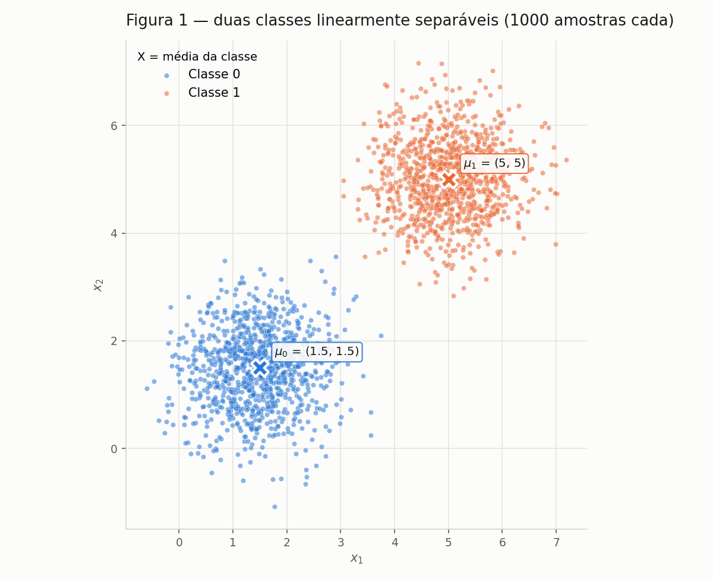
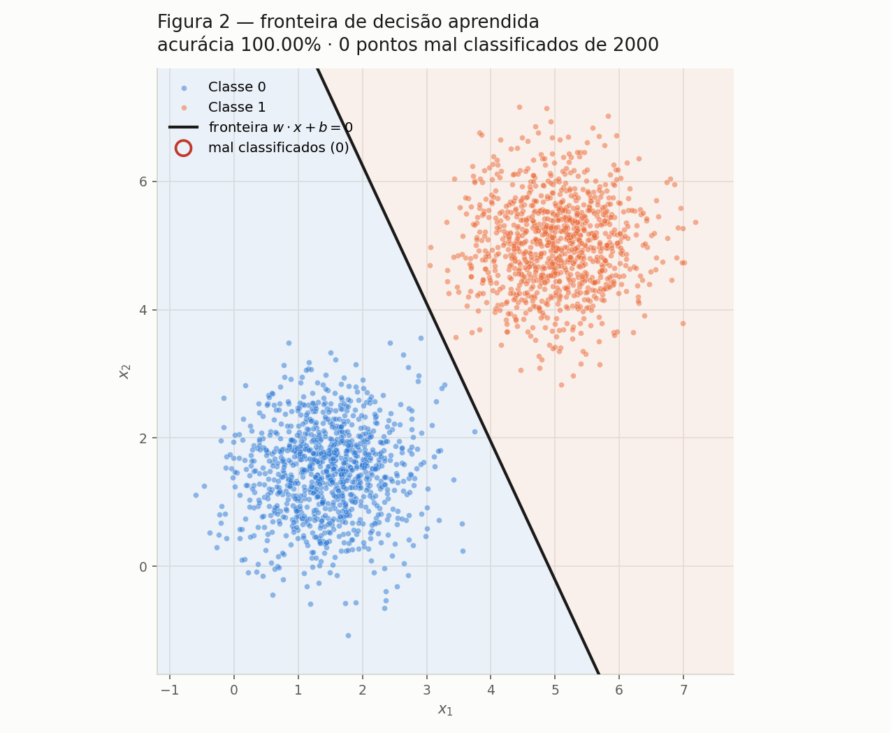
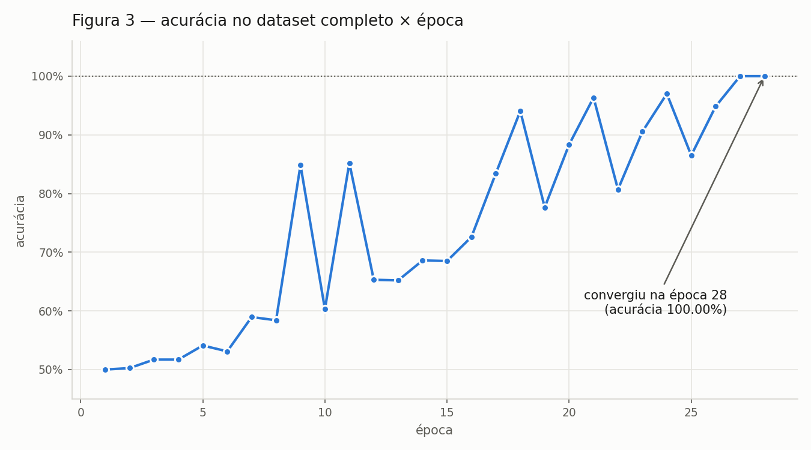
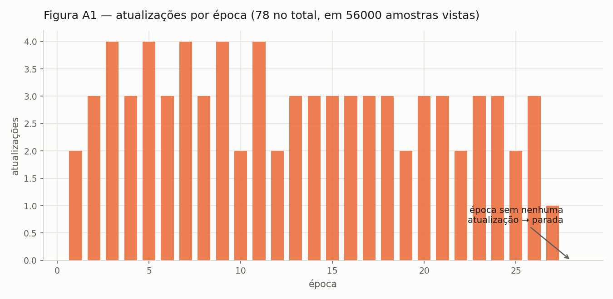
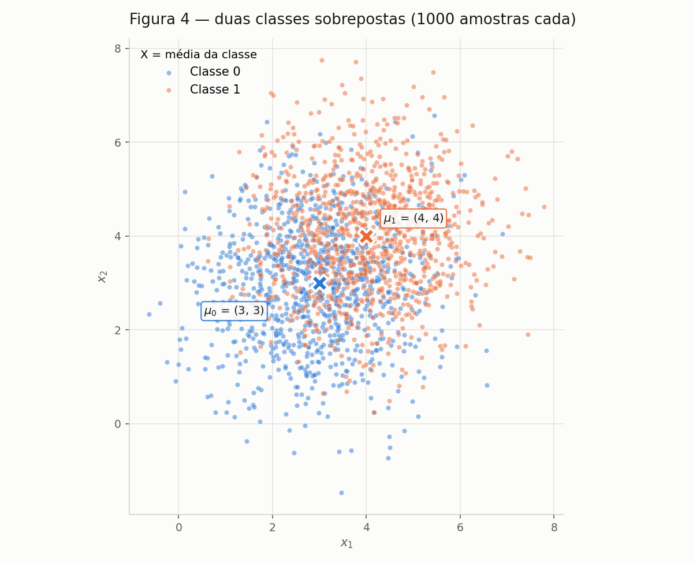
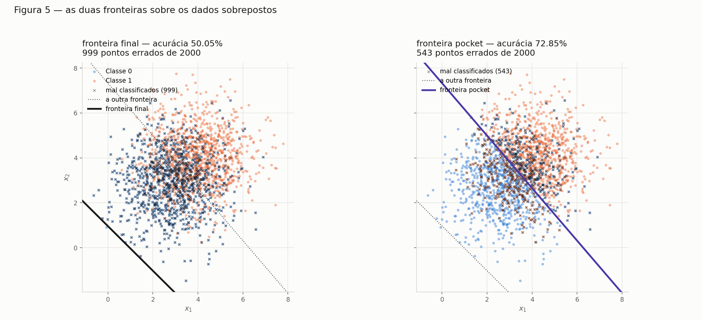
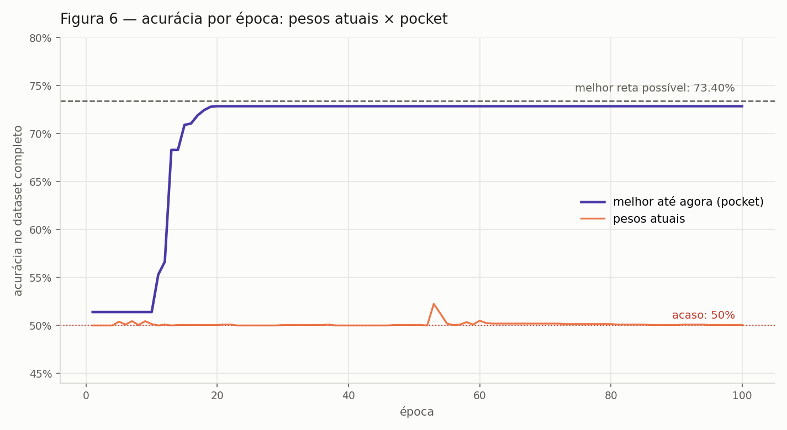
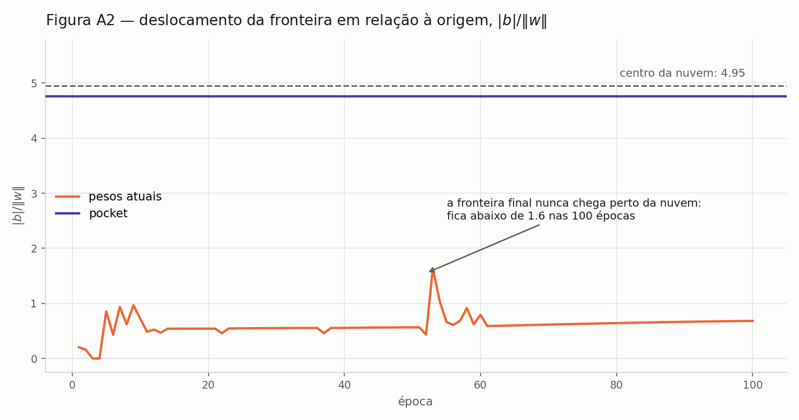

# Perceptron

Implementação e estudo do perceptron: primeiro no caso para o qual ele foi
projetado — dados linearmente separáveis — e depois no que acontece quando essa
hipótese deixa de valer.

Todo o código está em `code/` e roda com semente fixa (`SEED = 42`); as figuras
em `figures/` são exatamente as que os scripts produzem.

!!! info "Como reproduzir"

    ```bash
    pip install -r requirements.txt
    cd docs/exercises/perceptron/code
    python3 ex1_dados.py     # A: dados + Figura 1
    python3 perceptron.py    # B: implementação + treino no dataset separável
    python3 ex1c_treino.py   # C: Figuras 2, 3 e A1
    python3 ex1d_taxa.py     # D: análise da taxa de aprendizado
    python3 ex2_dados.py     # Ex. 2 A: dados sobrepostos + Figura 4
    python3 pocket.py        # Ex. 2 B: treino com pocket
    python3 ex2c_figuras.py  # Ex. 2 C: Figuras 5 e 6
    python3 ex2d_analise.py  # Ex. 2 D: análise + Figura A2
    ```

---

## Exercício 1

**Dados separáveis: o caso para o qual o perceptron foi projetado.**

### A — Gere os dados

Duas classes 2D, **1000 amostras cada**, de normais multivariadas com a mesma
covariância isotrópica:

| Classe | Média | Covariância |
|---|---|---|
| 0 | [1.5, 1.5] | [[0.5, 0], [0, 0.5]] |
| 1 | [5, 5] | [[0.5, 0], [0, 0.5]] |

Geradas com `rng.multivariate_normal(mu, cov, size=1000)` — covariância
diagonal e isotrópica (σ = √0.5 ≈ 0.707 em cada eixo, sem correlação), o que dá
duas nuvens circulares de mesmo tamanho.

#### Conferência amostral

| Classe | μ amostral | μ teórico | Covariância amostral |
|---|---|---|---|
| 0 | (1.450, 1.473) | (1.5, 1.5) | [[0.491, 0.029], [0.029, 0.513]] |
| 1 | (5.010, 5.013) | (5, 5) | [[0.495, 0.010], [0.010, 0.499]] |

As covariâncias amostrais reproduzem a diagonal 0.5 com termos cruzados
próximos de zero, como esperado.



**Figura 1** — os 2000 pontos, uma cor por classe, com a média de cada nuvem
marcada com **×**.

#### Por que estas nuvens são linearmente separáveis

A distância entre as médias é `‖μ₁ − μ₀‖ = √(3.5² + 3.5²) = 4.950`, enquanto o
desvio de cada nuvem é 0.707 por eixo. A razão entre as duas grandezas é
**4.950 / (2 × 0.707) = 3.500**: cada nuvem precisaria se esticar por 3.5
desvios para alcançar a outra, e uma gaussiana praticamente não vai tão longe.

Isso é o argumento das distribuições. Para a amostra concreta, verifiquei a
separabilidade diretamente — projetei os 2000 pontos na direção `μ₁ − μ₀` e
comparei os extremos:

```
classe 0 vai até     4.577
classe 1 começa em   4.962
folga entre as nuvens: +0.386   →  existe reta que separa os 2000 pontos
```

A folga é **positiva**, então qualquer reta perpendicular a `μ₁ − μ₀` cortando
essa faixa classifica as 2000 amostras sem um único erro. Essa é a condição
que o teorema da convergência do perceptron exige: com margem estritamente
positiva, o algoritmo termina em um número finito de atualizações.

### B — Implemente o perceptron

A implementação está em `code/perceptron.py`, num módulo próprio porque o
Exercício 2 a reutiliza sem alteração. É uma classe com `treinar`, `predizer` e
`acuracia`, sem nada específico deste dataset.

| Componente | Implementação |
|---|---|
| Predição | `ŷ = degrau(w · x + b)`, com `degrau(z) = 1` se `z ≥ 0`, senão `0` |
| Atualização (por amostra) | `w ← w + η(y − ŷ)x` e `b ← b + η(y − ŷ)` |
| Inicialização | `w ~ rng.normal(0, 0.01, size=2)`, `b = 0` |
| Taxa de aprendizado | `η = 0.01` |
| Parada | época sem nenhuma atualização, ou 100 épocas |

O erro `(y − ŷ)` assume três valores: **0** quando a predição está correta — e
aí nada é atualizado, o que é a economia central do algoritmo —, **+1** quando
a amostra era da classe 1 e foi prevista como 0, e **−1** no engano oposto. Os
dois sinais empurram o vetor `w` em direções contrárias, que é o que permite
corrigir os dois tipos de erro.

!!! warning "Por que não `w ← w + η y x`?"

    Porque essa forma pertence à convenção de rótulos **−1 / +1**, onde o
    próprio `y` carrega o sinal da correção. Com os rótulos **0 / 1** usados
    aqui, `y = 0` anularia a atualização inteira: o perceptron nunca aprenderia
    com uma amostra da classe 0 e, em particular, **jamais corrigiria um falso
    positivo** — um ponto da classe 0 previsto como 1 continuaria errado para
    sempre, porque a única atualização possível empurraria `w` sempre no mesmo
    sentido. Usando `(y − ŷ)`, o sinal vem da *direção do engano*, não do
    rótulo, e a regra funciona nas duas convenções.

#### Resultado no dataset separável

```
w inicial : [ 0.00305 -0.0104 ]   b inicial: 0.0
convergiu : True em 28 épocas (parada: época sem atualizações)
w final   : [0.05304 0.02462]     b final: -0.26000
acurácia final no dataset completo: 1.0000
```

Acurácia registrada ao fim de cada época (log completo na saída do script):

| Época | Atualizações | Acurácia | | Época | Atualizações | Acurácia |
|---|---|---|---|---|---|---|
| 1 | 2 | 0.5000 | | 18 | 3 | 0.9405 |
| 2 | 3 | 0.5025 | | 21 | 3 | 0.9635 |
| 5 | 4 | 0.5410 | | 24 | 3 | 0.9700 |
| 9 | 4 | 0.8485 | | 26 | 3 | 0.9485 |
| 12 | 2 | 0.6530 | | **27** | 1 | **1.0000** |
| 16 | 3 | 0.7260 | | **28** | **0** | **1.0000** |

Três leituras do treino:

- **Convergiu, como o teorema garante.** O item A mostrou margem positiva
  (folga +0.386), então a parada por "época sem atualizações" tinha que
  acontecer em tempo finito — e aconteceu na época 28, bem antes do teto de 100.
  A acurácia final é **100%**: nenhum dos 2000 pontos fica do lado errado.
- **O algoritmo é quase todo silêncio.** Foram **78 atualizações** em 56 000
  amostras processadas (0.14%). Todo o resto foram acertos, que por construção
  não mexem em `w` — o perceptron só gasta trabalho onde erra.
- **A acurácia sobe aos trancos, não em rampa.** Ela oscila entre 0.50 e 0.97
  ao longo do caminho porque este dataset está **ordenado por classe**: cada
  época percorre 1000 pontos da classe 0 e depois 1000 da classe 1, e a medição
  acontece logo após o bloco da classe 1, com a fronteira recém-empurrada para
  aquele lado. O que importa para a parada não é essa curva, e sim a contagem de
  atualizações, que é monótona no sentido certo.

Sobre esse último ponto, a classe aceita `embaralhar=True` para sortear a ordem
a cada época. Mantive **`False`** como padrão, que é a leitura literal do
enunciado ("uma passagem completa pelo dataset"), mas a comparação é
instrutiva:

| Ordem das amostras | Épocas até convergir | Atualizações | Acurácia final |
|---|---|---|---|
| Na ordem do dataset (padrão) | **28** | 78 | 1.0000 |
| Embaralhada a cada época | **3** | 83 | 1.0000 |

O custo real — o número de correções — é praticamente o mesmo (78 contra 83).
O que muda é quantas **passagens** são necessárias para gastá-las: com os dados
ordenados, cada época aplica só 2 ou 3 correções e desperdiça o resto da
varredura, enquanto embaralhando elas se distribuem e o algoritmo termina em
três passagens.

Por fim, uma verificação geométrica: o `w` final faz **20.1°** com a direção
`μ₁ − μ₀`. Não é paralelo a ela — o perceptron não busca a direção que liga as
médias, nem a margem máxima; ele para na primeira fronteira que não erra, e
essa depende de quais pontos por acaso geraram as últimas correções.

### C — Treine e meça

```
w final   : [0.05304, 0.02462]
b final   : -0.26000
épocas    : 28  (parada por época sem atualizações, teto era 100)
acurácia  : 1.0000  →  0 erros em 2000 pontos
```



**Figura 2** — a fronteira `w · x + b = 0` sobre os 2000 pontos, com o
semiplano de cada decisão sombreado ao fundo. Os pontos mal classificados
seriam marcados com um círculo vermelho; **a contagem é zero**, então a
marcação não aparece — a legenda registra o número para deixar isso explícito
em vez de silencioso.



**Figura 3** — acurácia no dataset completo ao fim de cada época. A subida é
irregular, com quedas de até 20 pontos percentuais entre épocas consecutivas, e
o motivo está no item D.1.

### D — Análise

#### D.1 — Por que dados separáveis convergem rápido?

Porque **a regra de atualização só dispara em erro**, e num dataset separável o
número total de erros possíveis é finito e pequeno — governado pela *geometria*
das nuvens, não pelo tamanho do dataset.

Quando a predição está certa, `(y − ŷ) = 0` e a atualização é literalmente
`w ← w + 0`: a amostra passa sem custo. Só os enganos movem o vetor, e cada
engano move `w` exatamente na direção que corrige aquele ponto (soma `+ηx` se a
classe 1 foi perdida, `−ηx` se a classe 0 foi invadida). Com margem positiva
existe um `w*` que acerta tudo, e o teorema da convergência limita o total de
atualizações por `(R/γ)²`, onde `R` é a maior norma de amostra e `γ` a margem.
Neste dataset, `R = 9.17` e `γ ≥ 0.193`, o que dá um teto de **≈ 2 260
atualizações** — e o treino gastou **78**. O limite não depende de haver 2000
ou 2 milhões de pontos: depende de quão separadas as nuvens estão.

**O que acontece com as atualizações por época?** Elas secam — e o momento em
que chegam a zero *é* o critério de parada.



**Figura A1** — atualizações por época no treino do item C.

Aqui vale uma ressalva honesta sobre a forma dessa curva. No treino padrão a
contagem **não** cai em rampa: fica em 2–4 por época durante 26 épocas e só
então despenca para 1 e 0. Isso é efeito da ordem do dataset, que está
agrupado por classe. Cada época percorre 1000 pontos da classe 0 e depois 1000
da classe 1, e basta um ou dois erros em cada bloco para que `w` seja
reajustado e o resto do bloco passe limpo. O saldo líquido de cada época é um
empurrão de cerca de −0.01 no viés `b`, que caminha de 0 até **−0.26** — quando
`b` finalmente coloca a reta dentro do vão entre as nuvens, os erros cessam de
uma vez. É também o que explica a Figura 3: a acurácia é medida logo após o
bloco da classe 1, com a fronteira recém-empurrada para aquele lado.

Embaralhando as amostras a cada época, o mesmo mecanismo aparece na forma
clássica, decrescente:

| Ordem | Atualizações por época |
|---|---|
| Ordem do dataset | 2, 3, 4, 3, 4, 3, 4, 3, 4, 2, 4, 2, 3, 3, 3, 3, 3, 3, 2, 3, 3, 2, 3, 3, 2, 3, 1, **0** |
| Embaralhada | 68, 15, **0** |

Com as classes misturadas, a primeira passagem já corrige 68 pontos, a segunda
só 15, a terceira nenhum. É a mesma afirmação nos dois casos — **a fronteira
melhora, os erros ficam mais raros, as atualizações desaparecem** —, mas a
ordem dos dados decide se isso acontece em 3 passagens ou em 28.

#### D.2 — O mesmo treino com η = 1.0

| | η = 0.01 | η = 1.0 |
|---|---|---|
| Épocas até convergir | 28 | **33** |
| Acurácia final | 1.0000 | **1.0000** |
| `w` final | [0.05304, 0.02462] | [4.96351, 3.76682] |
| `b` final | −0.26000 | −29.00000 |
| `‖w‖` | 0.0585 | **6.2310** |
| Direção `w/‖w‖` | [0.90708, 0.42096] | [0.79658, 0.60453] |
| Atualizações | 78 | 91 |

As duas chegam a 100%, como o enunciado antecipa, mas **por fronteiras
diferentes**: as direções de `w` estão a **12.30°** uma da outra. (Nos 2000
pontos do treino as predições coincidem — as retas só divergem fora da nuvem,
no espaço onde não há dado para discordar.)

**O que η controla, então?** O tamanho do passo *em relação ao que já existe
em `w`*. Cada correção soma `ηx`, com `‖x‖` da ordem de 7 neste dataset:

- Com **η = 0.01**, cada passo tem magnitude ~0.07 contra um `w` inicial de
  magnitude ~0.01. Já a primeira correção domina o vetor inicial, e daí em
  diante `w` cresce devagar: as 78 correções o levam a `‖w‖ = 0.058`.
- Com **η = 1.0**, cada passo tem magnitude ~7 — cem vezes maior. O `w` final
  tem norma 6.23, **106 vezes** a do outro.

Duas consequências. Primeira: a norma de `w` **não muda a classificação**, já
que o sinal de `w·x + b` é invariante a multiplicar tudo por uma constante
positiva; nesse sentido η é inofensivo. Segunda, e é a que importa: η muda
**quanto cada engano individual pesa contra a memória acumulada**. Com passo
grande, um único ponto mal classificado pode girar a fronteira inteira; com
passo pequeno, ele só a desloca um pouco, e a direção final resulta da média de
muitas correções. Por isso as duas execuções param em ângulos diferentes — e
por isso η importa muito mais no Exercício 2, onde os dados não são separáveis
e as correções nunca cessam.

#### D.3 — Por que não começar de w = 0

Suponha `w₀ = 0` e `b₀ = 0`, e duas execuções idênticas em tudo (mesmos dados,
mesma ordem) exceto pela taxa: `η₁` e `η₂`. Afirmo que, em todo instante `t`,

```
w₂(t) = c · w₁(t)        e        b₂(t) = c · b₁(t),      com  c = η₂/η₁ > 0
```

**Prova por indução.** Em `t = 0` vale trivialmente, porque `0 = c · 0` para
qualquer `c`. Suponha que vale em `t`. A predição na
amostra seguinte depende apenas do **sinal** de `w·x + b`, e

```
w₂(t) · x + b₂(t) = c · ( w₁(t) · x + b₁(t) )
```

com `c > 0` — multiplicar por uma constante positiva não muda sinal, logo
**as duas execuções produzem o mesmo `ŷ`**, portanto o mesmo erro `(y − ŷ)`, e
portanto atualizam ou não atualizam juntas. Quando atualizam:

```
w₂(t+1) = w₂(t) + η₂(y−ŷ)x
        = c·w₁(t) + c·η₁(y−ŷ)x          (hipótese de indução, e η₂ = c·η₁)
        = c·( w₁(t) + η₁(y−ŷ)x )
        = c·w₁(t+1)
```

e o mesmo para `b`. A relação se preserva, o que fecha a indução. ∎

**Consequências.** As duas execuções tomam exatamente as mesmas decisões, na
mesma ordem, erram nos mesmos pontos e param na mesma época; a fronteira
`{x : w·x + b = 0}` é idêntica, porque `c·w·x + c·b = 0` define a mesma reta
que `w·x + b = 0`. Ou seja, **partindo do zero, η não tem efeito nenhum** — ela
só reescala o vetor final, e a pergunta do item D.2 não faria sentido. É por
isso que o item B pede `w ~ rng.normal(0, 0.01)`: o `w` inicial é o único
elemento cuja magnitude **não** é multiplicada por η, e é a existência dele que
faz a razão entre "tamanho do passo" e "tamanho do que já foi aprendido"
significar alguma coisa.

Verifiquei numericamente, rodando o treino a partir de `w = 0`:

```
eta = 0.01  -> épocas  37 | acurácia 1.0000 | w = [0.05868, 0.03350] | b = -0.31000
eta = 1.0   -> épocas  37 | acurácia 1.0000 | w = [5.86808, 3.35029] | b = -31.00000

w(eta=1.0) == 100 * w(eta=0.01)?  True
b(eta=1.0) == 100 * b(eta=0.01)?  True
mesmo número de épocas?           True
ângulo entre as direções:         0.0000°
predições idênticas?              True
```

Cem vezes a taxa, cem vezes os pesos, **zero grau** de diferença na fronteira e
o mesmo número de épocas — exatamente o que a álgebra prevê. Compare com o item
D.2, onde a mesma mudança de η, partindo de um `w` aleatório, deu 12.30° de
diferença e cinco épocas a mais.

### Código do Exercício 1

??? example "code/ex1c_treino.py — treino e Figuras 2, 3 e A1"

    ```python
    --8<-- "docs/exercises/perceptron/code/ex1c_treino.py"
    ```

??? example "code/ex1d_taxa.py — análise da taxa de aprendizado (D.2 e D.3)"

    ```python
    --8<-- "docs/exercises/perceptron/code/ex1d_taxa.py"
    ```

??? example "code/perceptron.py — a implementação do perceptron (reutilizada no Exercício 2)"

    ```python
    --8<-- "docs/exercises/perceptron/code/perceptron.py"
    ```

??? example "code/ex1_dados.py — geração dos dados e Figura 1"

    ```python
    --8<-- "docs/exercises/perceptron/code/ex1_dados.py"
    ```

??? example "code/_saida.py — caminhos de figures/ e data/"

    ```python
    --8<-- "docs/exercises/perceptron/code/_saida.py"
    ```

---

## Exercício 2

**Dados sobrepostos: o caso que o perceptron não resolve.**

### A — Gere os dados

Mesmo formato do Exercício 1 — 1000 amostras por classe, normais multivariadas
isotrópicas — mas com as médias três vezes mais próximas e o espalhamento três
vezes maior:

| Classe | Média | Covariância |
|---|---|---|
| 0 | [3, 3] | [[1.5, 0], [0, 1.5]] |
| 1 | [4, 4] | [[1.5, 0], [0, 1.5]] |

| Classe | μ amostral | Desvio amostral |
|---|---|---|
| 0 | (2.913, 2.952) | (1.214, 1.241) |
| 1 | (4.018, 4.022) | (1.218, 1.224) |



**Figura 4** — os 2000 pontos, uma cor por classe. As duas nuvens ocupam
praticamente a mesma região.

#### Quanto mudou em relação ao Exercício 1

| | Exercício 1 | Exercício 2 |
|---|---|---|
| Distância entre médias | 4.950 | **1.414** |
| Desvio por eixo | 0.707 | **1.225** |
| Razão `d / 2σ` | **3.500** | **0.577** |
| Folga entre as nuvens | **+0.386** | **−6.491** |

A razão de separação despencou de 3.5 para 0.577 — abaixo de 1, o limiar em que
as nuvens deixam de ter um vale de baixa densidade entre elas. A folga na
direção `μ₁ − μ₀` é **negativa**: projetando os pontos nessa direção, a classe 0
vai até 8.495 enquanto a classe 1 começa em 2.004. Elas se atravessam por quase
6.5 unidades, e **nenhuma reta separa os 2000 pontos**.

Dois tetos de referência para o resto do exercício:

- **71.81%** é o acerto da fronteira ótima teórica. Como as duas gaussianas têm
  a mesma covariância isotrópica, a fronteira ótima é a mediatriz entre as
  médias, e o acerto é `Φ(d / 2σ) = Φ(0.577)`.
- **73.40%** é a melhor reta possível *nesta amostra*, medida por busca
  exaustiva (720 direções × todos os cortes de cada uma). Fica um pouco acima do
  ótimo teórico porque se ajusta ao sorteio concreto.

### B — Treine guardando os melhores pesos

A implementação do Exercício 1 foi reutilizada **sem alteração**: `perceptron.py`
está intacto e o Exercício 1 continua reproduzindo exatamente os mesmos números.
O pocket entra em `pocket.py`, numa classe que **herda** de `Perceptron` e só
reescreve `treinar` — `degrau`, `predizer`, `acuracia` e `reta_de_decisao` vêm
da classe mãe. A única ideia nova dentro do laço são três linhas:

```python
if erro:
    self.w_ += self.eta * erro * xi
    self.b_ += self.eta * erro

    acc = self.acuracia(X, y)          # <- avalia no dataset completo
    if acc > self.melhor_acuracia_:    # <- melhorou?
        self.melhor_acuracia_ = acc    # <- então guarda no bolso
        self.w_pocket_, self.b_pocket_ = self.w_.copy(), self.b_
```

Mesmo `η = 0.01`, mesmo teto de 100 épocas. O bolso começa com os pesos
iniciais como "melhor até agora", para que exista sempre um candidato válido.

```
épocas executadas : 100  (nunca houve uma época sem atualização)
atualizações      : 384
trocas de bolso   : 11
```

| | `w` | `b` | Acurácia |
|---|---|---|---|
| Pesos **finais** | [0.04132, 0.04150] | −0.04000 | **50.05%** |
| Pesos do **pocket** | [0.00638, 0.00546] | −0.04000 | **72.85%** |

Os dois números ficam a **22.8 pontos percentuais** de distância. Os pesos
finais acertam 50.05% — o que se obtém chutando — enquanto o pocket chega a
72.85%, a 0.55 ponto do teto de 73.40%. Isso não é bug: é o resultado correto, e
o item D explica.

### C — Figuras



**Figura 5** — as duas fronteiras sobre os mesmos pontos, cada painel marcando
com **×** escuro os pontos que *aquela* fronteira erra (a outra fronteira
aparece pontilhada, para comparação). À esquerda, a reta final passa **por fora
da nuvem**, deixando quase tudo de um lado só: 999 erros. À direita, a reta do
pocket corta entre as classes: 543 erros.



**Figura 6** — acurácia dos pesos atuais e do melhor até agora, época a época. A
curva do pocket é monótona por construção, sobe até 72.85% por volta da época 19
e trava ali. A dos pesos atuais fica **colada nos 50%** durante as 100 épocas
inteiras, com picos ocasionais de no máximo 52.25%.

### D — Análise

#### D.1 — Por que os pesos finais ficam em 50% e o pocket não

O pocket chega a **72.85%**, a meio ponto do teto de 73.40%; os finais ficam em
**50.05%**. A diferença não é sobre qualidade de aprendizado — é sobre **qual
instante do treino você escolhe olhar**.

Como nenhuma reta separa os dados, sempre existe algum ponto mal classificado,
então o laço **nunca para de atualizar**. Os pesos finais não são o resultado de
uma convergência: são apenas a fotografia dos pesos logo depois da última
correção da centésima época — e uma correção acontece exatamente porque aquele
ponto estava errado, ou seja, os pesos finais são sempre "os pesos recém
empurrados para acomodar um ponto qualquer". O pocket, ao contrário, é uma
escolha deliberada: guarda os pesos no melhor instante já visto, em vez do
último.

**Onde a fronteira final para, e por quê.** Aqui entra a dica do enunciado.
Cada engano aplica

```
Δw = η (y − ŷ) x        com ‖x‖ ≈ 5.07 neste dataset   →   ‖Δw‖ ≈ 0.0507
Δb = η (y − ŷ)          com o "1" implícito do viés     →   |Δb|  = 0.0100
```

O vetor `w` anda **5 vezes mais rápido que o viés `b`** a cada correção, porque
`x` tem norma ~5 e o viés multiplica sempre 1. A posição da reta depende das
duas grandezas juntas: a distância da fronteira até a origem é `|b| / ‖w‖`. Se
`‖w‖` cresce cinco vezes mais rápido do que `|b|`, essa razão **encolhe** — a
reta é arrastada para perto da origem, enquanto os dados vivem em torno de
(3.5, 3.5), a 4.95 da origem.

| | `‖w‖` | \|b\| | \|b\| / ‖w‖ |
|---|---|---|---|
| Pesos finais | 0.05856 | 0.04000 | **0.683** |
| Pesos do pocket | 0.00840 | 0.04000 | **4.763** |
| Centro da nuvem (referência) | | | **4.950** |

O pocket guardou os pesos num instante em que `‖w‖` ainda era pequeno e a razão
valia 4.76 — praticamente em cima da nuvem. Os finais têm `‖w‖` sete vezes maior
e a fronteira a 0.68 da origem: **ela corta o plano fora dos dados**, e é
exatamente isso que a Figura 5 mostra à esquerda. Com a nuvem inteira de um lado
só, a acurácia cai para a proporção das classes — 50%.



**Figura A2** — o deslocamento `|b| / ‖w‖` dos pesos atuais ao longo das 100
épocas nunca passa de 1.6, contra os 4.95 onde a nuvem está. O pocket (linha
roxa) ficou parado no único momento em que a fronteira esteve no lugar certo.

#### D.2 — Figura 3 contra Figura 6: o que o teorema garante

No Exercício 1 a curva de acurácia **estabiliza** em 100% e o treino para
sozinho; aqui ela nunca estabiliza — oscila em torno de 50% até a época 100, e o
que interrompe o treino é o teto de épocas, não o algoritmo.

O **teorema da convergência do perceptron** garante o seguinte: *se* existe um
vetor `w*` e uma margem `γ > 0` tais que todo ponto do conjunto é classificado
corretamente com folga pelo menos `γ`, *então* o número de atualizações é finito
e limitado por `(R/γ)²`, com `R = maxᵢ‖xᵢ‖`. A conclusão é forte — parada em
tempo finito, erro zero — mas é **condicional**.

A hipótese violada aqui é justamente a da premissa: **a separabilidade linear**.
Não existe `w*` que acerte todos os pontos, logo não existe margem `γ > 0`, logo
`(R/γ)²` não é um número — o limite "explode" e o teorema simplesmente não diz
nada sobre este caso. Medido no item A: a folga na direção das médias é
**−6.491**, e a melhor reta possível erra 26.6% dos pontos.

E a consequência é visível nas duas figuras lado a lado:

| | Exercício 1 (Figura 3) | Exercício 2 (Figura 6) |
|---|---|---|
| Margem | +0.386 | −6.491 |
| Atualizações | 78, depois **zero** | 384, e **nunca zero** |
| Parada | época sem atualizações (28ª) | teto de 100 épocas |
| Acurácia final | 100% | 50.05% |

#### D.3 — Mais épocas resolvem? Um η menor resolve?

**Nenhum dos dois**, e a razão está na própria regra de atualização, não em
tentativa e erro.

A regra só tem um gatilho: `erro = y − ŷ ≠ 0`. Num dataset sobreposto, **toda**
configuração de pesos deixa pelo menos 26.6% dos pontos errados — é o que o teto
de 73.40% significa. Então, para qualquer `w` e qualquer instante, sempre existe
um ponto que dispara uma atualização. O laço não tem ponto fixo: ele é um
processo que não termina, e cada passagem embaralha os pesos de novo.

**Mais épocas** só produzem mais correções desse tipo. Medido:

| Épocas | Acurácia final | Acurácia do pocket | Atualizações | \|b\|/‖w‖ final |
|---|---|---|---|---|
| 100 | 50.05% | 72.85% | 384 | 0.683 |
| 500 | 50.20% | **73.15%** | 1 984 | **0.595** |

Cinco vezes mais épocas movem a acurácia final em 0.15 ponto — ruído — e o
deslocamento da fronteira fica **pior** (0.595 contra 0.683), porque `‖w‖`
continuou crescendo. O pocket ganha 0.3 ponto, mas não por aprender: só porque
teve mais sorteios para amostrar uma reta boa.

**Um η menor** também não, e por um motivo estrutural: η multiplica igualmente
os dois lados da atualização, `Δw = η(y−ŷ)x` e `Δb = η(y−ŷ)`. A razão entre eles
continua sendo `‖x‖ ≈ 5` seja qual for η — que é exatamente o desequilíbrio que
deixa a fronteira fora da nuvem. Diminuir η encolhe o passo, não o corrige.

| η | Acurácia final | Acurácia do pocket | Atualizações | \|b\|/‖w‖ final |
|---|---|---|---|---|
| 0.01 | 50.05% | 72.85% | 384 | 0.683 |
| 0.001 | 50.40% | 73.00% | 384 | 0.751 |
| 0.0001 | 50.15% | 71.10% | 459 | 0.796 |

Cem vezes menor, e a acurácia final segue em 50%: a contagem de atualizações
nem muda (384 nos dois primeiros casos), porque **quem gera os erros é a
geometria dos dados, não o tamanho do passo**.

O que de fato resolveria é mudar o critério, não o ajuste fino: guardar o melhor
(pocket, que já leva a 72.85%), trocar a perda do degrau por uma diferenciável
com mínimo bem definido — regressão logística converge para o ótimo em vez de
oscilar —, ou aceitar que 73.40% é o teto de qualquer reta e ir para uma
fronteira não-linear. Mais épocas e η menor são as duas únicas coisas que
comprovadamente **não** ajudam.

### Código do Exercício 2

??? example "code/ex2_dados.py — dados sobrepostos, Figura 4 e os tetos de referência"

    ```python
    --8<-- "docs/exercises/perceptron/code/ex2_dados.py"
    ```

??? example "code/pocket.py — o algoritmo pocket, herdando de Perceptron"

    ```python
    --8<-- "docs/exercises/perceptron/code/pocket.py"
    ```

??? example "code/ex2c_figuras.py — Figuras 5 e 6"

    ```python
    --8<-- "docs/exercises/perceptron/code/ex2c_figuras.py"
    ```

??? example "code/ex2d_analise.py — análise do item D e Figura A2"

    ```python
    --8<-- "docs/exercises/perceptron/code/ex2d_analise.py"
    ```

---

## Resumo dos resultados

| # | Quantidade | Valor |
|---|---|---|
| 1 | Exercício 1 — `w` e `b` finais | **w = [0.05304, 0.02462]** · **b = −0.26000** |
| 2 | Exercício 1 — épocas até convergir | **28** |
| 3 | Exercício 1 — acurácia final | **100.00%** (0 erros em 2000) |
| 4 | Exercício 1 — épocas e acurácia final com η = 1.0 | **33 épocas** · **100.00%** |
| 5 | Exercício 2 — `w` e `b` finais | **w = [0.04132, 0.04150]** · **b = −0.04000** |
| 6 | Exercício 2 — acurácia dos pesos finais | **50.05%** |
| 7 | Exercício 2 — acurácia dos pesos do pocket | **72.85%** |
| 8 | Exercício 2 — época em que o melhor do pocket ocorreu | **20** |

Notas sobre duas linhas:

- **Linha 4:** com η = 1.0 a acurácia é a mesma do η = 0.01 (100%), mas a
  fronteira é outra — as direções de `w` ficam a 12.30° uma da outra, como
  detalha o item D.2 do Exercício 1.
- **Linha 8:** a acurácia do pocket atinge 72.85% durante a **época 20** e não
  melhora mais nas 80 épocas restantes. Para referência, o teto de qualquer reta
  neste dataset é 73.40%, medido por busca exaustiva.
